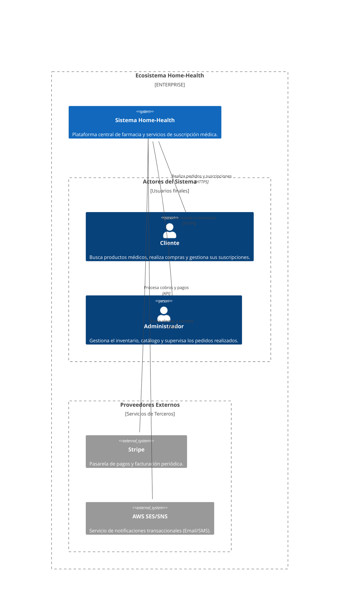
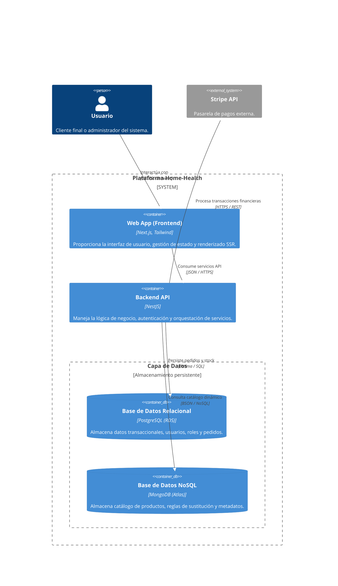
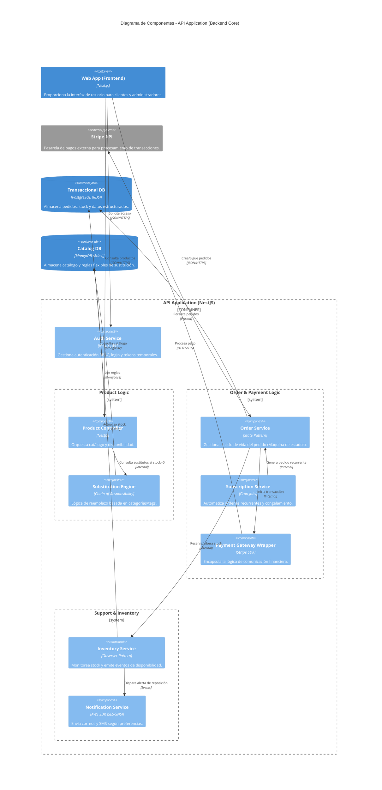

# 🏛️ Arquitectura de Software - Modelo C4

Este documento detalla la arquitectura del sistema **Home-Health** utilizando el modelo C4 (Contexto, Contenedores, Componentes). Esta metodología permite visualizar la estructura del software en diferentes niveles de abstracción, facilitando la comunicación técnica y la planificación de la infraestructura.

## Control de Versiones

| Versión | Fecha      | Descripción                                               | Responsables  |
| :------ | :--------- | :-------------------------------------------------------- | :------------ |
| 1.0     | 09/04/2026 | Definición inicial de los niveles 1, 2 y 3 del modelo C4. | Sebastian Gol |

---

## 🌎 Nivel 1: Diagrama de Contexto

El diagrama de contexto muestra el panorama general del sistema **Home-Health** y cómo interactúa con los usuarios y servicios externos de terceros.

---

## 📦 Nivel 2: Diagrama de Contenedores

Este nivel hace "zoom" dentro del sistema para identificar las aplicaciones, servicios y bases de datos que lo componen, fundamentales para el despliegue en **AWS Fargate**.

---

## 🧱 Nivel 3: Diagrama de Componentes (Backend API)

Detalle interno del contenedor **Backend API**, resaltando la implementación de patrones de diseño tácticos.

---

## 🧠 Justificación Arquitectónica y Patrones

> [!IMPORTANT]
>
> ### Decisiones de Diseño Clave:
>
> 1.  **Desacoplamiento de Datos:** El Backend API actúa como un mediador para la persistencia políglota, aislando al Frontend de la complejidad de manejar dos motores de base de datos.
> 2.  **Seguridad y Cumplimiento:** Los datos sensibles de pago se delegan a **Stripe**, asegurando que la infraestructura de Home-Health no almacene información financiera crítica.
> 3.  **Patrones de Diseño Implementados:**
>     - **Chain of Responsibility (Substitution Engine):** Permite una búsqueda jerárquica de productos alternativos de forma extensible.
>     - **State Pattern (Order Service):** Garantiza transiciones de estado legales y un ciclo de vida de pedidos auditable.
>     - **Observer Pattern (Inventory Service):** Automatiza la comunicación de eventos de stock (como reposiciones) hacia el sistema de notificaciones.
> 4.  **Preparación Cloud:** La división en contenedores claros facilita la orquestación en **AWS Fargate**, permitiendo un escalado independiente de la interfaz y la lógica de negocio.
