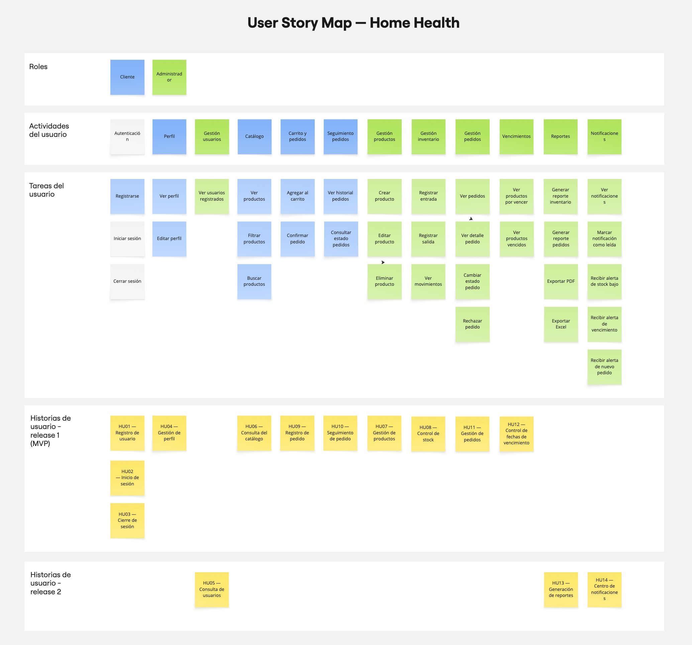

# Story Map — Home-Health

## Control de Versiones

| Versión | Fecha       | Descripción                                                                                                                                                | Responsables                                      |
| :------ | :---------- | :--------------------------------------------------------------------------------------------------------------------------------------------------------- | :------------------------------------------------ |
| 1.0     | 02/05/2026  | Construcción inicial del Story Map en Miro a partir de actividades de usuario y flujos del MVP.                                                            | Sebastian Puentes, Karina Cantillo, Danay Pereira |
| 1.1     | 09/05/2026  | Asociación de tareas con HU formales y separación inicial por roles.                                                                                       | Sebastian Puentes, Karina Cantillo, Danay Pereira |
| 2.0     | 12/05/2026  | Redacción del Story Map como documento autocontenido: backbone, walking skeleton, enrichment, plan de releases, priorización MoSCoW y trazabilidad con HU. | Sebastian Puentes, Karina Cantillo, Danay Pereira |

---

## 1. Marco Conceptual

El Story Mapping es una técnica de planificación de producto introducida por **Jeff Patton (2014)** en *User Story Mapping: Discover the Whole Story, Build the Right Product*, cuyo propósito es construir una narrativa visual del comportamiento esperado del sistema desde la perspectiva del usuario, ordenada en dos ejes:

- **Eje horizontal (backbone)**: la secuencia narrativa de **actividades** que un usuario realiza para alcanzar sus objetivos. Representa el "qué" hace el usuario.
- **Eje vertical (cuerpo)**: el **detalle de tareas y opciones** asociadas a cada actividad, ordenadas de mayor a menor prioridad. Representa el "cómo" y permite cortes incrementales de entrega.

A diferencia de un *backlog* lineal, el Story Map preserva el **contexto narrativo** del usuario y permite distinguir entre la **funcionalidad mínima viable** (lo que debe entregarse para que el flujo end-to-end sea utilizable) y la **funcionalidad de enriquecimiento** (lo que mejora la experiencia pero no es indispensable).

Este artefacto se complementa con el concepto de **Walking Skeleton**, definido por **Alistair Cockburn (2004)** como "una implementación delgada de una funcionalidad end-to-end que ejecuta una arquitectura real con código real". El walking skeleton del Story Map identifica el corte horizontal mínimo que prueba que **todas las piezas de la arquitectura se integran** y producen valor real al usuario.

La priorización del MVP se aborda mediante la técnica **MoSCoW** (Clegg & Barker, 1994), clasificando cada HU en: *Must have*, *Should have*, *Could have*, *Won't have (this time)*.

**Referencias clave**: Patton (2014); Cockburn (2004); Cohn (2004) *User Stories Applied*; Clegg & Barker (1994) *Case Method Fast-Track: A RAD Approach*.

---

## 2. Story Map en Miro (Artefacto Colaborativo)

El tablero vivo de trabajo se mantiene en Miro como herramienta colaborativa del equipo:

🔗 **Tablero Miro**: https://miro.com/app/board/uXjVHZHXBDA=/?share_link_id=175424242890

📸 **Captura del Story Map**:



> **Nota**: El presente documento es la versión **autocontenida y formal** del Story Map. La captura y el enlace a Miro se conservan únicamente como respaldo colaborativo del equipo; toda la información necesaria para evaluar el artefacto se encuentra a continuación.

---

## 3. Identificación de Usuarios y Objetivos

| Persona             | Rol técnico    | Objetivo principal en el sistema                                                                                       |
| :------------------ | :------------- | :--------------------------------------------------------------------------------------------------------------------- |
| **Cliente final**   | CLIENT         | Adquirir medicamentos a domicilio de forma rápida, confiable y trazable.                                               |
| **Administrador**   | ADMIN          | Operar la farmacia digitalmente: catálogo, inventario, pedidos, vencimientos, reportes y notificaciones.               |

---

## 4. Backbone — Actividades de Alto Nivel

El backbone es la secuencia narrativa de actividades que recorre un usuario de la plataforma. Se divide en dos narrativas paralelas, una por rol.

### 4.1 Narrativa del Cliente

```
[1. Crear cuenta]  →  [2. Iniciar sesión]  →  [3. Explorar catálogo]  →  [4. Armar pedido]  →  [5. Confirmar pedido]  →  [6. Seguir pedido]  →  [7. Gestionar perfil]
```

### 4.2 Narrativa del Administrador

```
[1. Iniciar sesión]  →  [2. Monitorear panel]  →  [3. Gestionar catálogo]  →  [4. Controlar inventario]  →  [5. Procesar pedidos]  →  [6. Vigilar vencimientos]  →  [7. Atender notificaciones]  →  [8. Generar reportes]  →  [9. Gestionar usuarios]
```

---

## 5. Tareas por Actividad (cuerpo del Story Map)

Cada actividad del backbone se descompone en tareas. Cada tarea está asociada a una o más Historias de Usuario formales documentadas en [`HU.md`](./HU.md).

### 5.1 Cliente

| Actividad           | Tareas (con HU asociada)                                                                                                                                                 |
| :------------------ | :----------------------------------------------------------------------------------------------------------------------------------------------------------------------- |
| **Crear cuenta**    | Registro con validación de correo, teléfono y contraseña fuerte → **HU01**                                                                                               |
| **Iniciar sesión**  | Login con JWT → **HU02** · Cierre de sesión → **HU03**                                                                                                                   |
| **Explorar catálogo** | Listado completo con stock > 0 → **HU06** · Filtro por categoría → **HU06.2** · Búsqueda por nombre con debounce → **HU06.3** · Detalle de producto → **HU06.4**         |
| **Armar pedido**    | Agregar al carrito · Modificar cantidades · Persistir carrito en local → **HU09**                                                                                        |
| **Confirmar pedido**| Ingresar dirección · Confirmar · Recibir número de pedido → **HU09**                                                                                                     |
| **Seguir pedido**   | Ver historial → **HU10** · Ver detalle con timeline · Cancelar pedido en estado Pendiente → **HU16**                                                                     |
| **Gestionar perfil**| Ver datos · Editar nombre y teléfono → **HU04** · Eliminar cuenta → **HU16.2**                                                                                            |

### 5.2 Administrador

| Actividad             | Tareas (con HU asociada)                                                                                                                                                                          |
| :-------------------- | :------------------------------------------------------------------------------------------------------------------------------------------------------------------------------------------------ |
| **Iniciar sesión**    | Login admin (cuenta seed) → **HU02**                                                                                                                                                              |
| **Monitorear panel**  | Dashboard con KPIs · Alertas activas · Acciones rápidas · Pedidos recientes → **HU11.dash**                                                                                                       |
| **Gestionar catálogo**| Listar / Crear / Editar / Eliminar productos → **HU07** · Subir imágenes (spike) → **HU20**                                                                                                       |
| **Controlar inventario** | Registrar entrada / salida → **HU08** · Validar stock no negativo · Ver historial de movimientos                                                                                                |
| **Procesar pedidos**  | Listado y filtros → **HU11** · Cambiar estado siguiendo máquina de estados · Rechazar pedido · Ver historial de cambios                                                                           |
| **Vigilar vencimientos** | Listado próximos a vencer (≤30d) → **HU12** · Listado vencidos · Retirar producto vencido                                                                                                       |
| **Atender notificaciones** | Centro de notificaciones → **HU14** · Marcar como leída · Filtrar por tipo                                                                                                                    |
| **Generar reportes**  | Reporte de inventario actual → **HU13** · Reporte de ventas por periodo · Exportar PDF/Excel/CSV → **HU18**                                                                                       |
| **Gestionar usuarios**| Listar usuarios → **HU05** · Editar perfil de cualquier usuario → **HU15** · Activar/desactivar cuentas                                                                                           |

---

## 6. Walking Skeleton (corte vertical mínimo end-to-end)

El walking skeleton es el subconjunto mínimo de HU que, integradas, **prueban que la arquitectura completa funciona**: frontend ↔ API REST ↔ base de datos PostgreSQL ↔ autenticación JWT ↔ despliegue Docker en AWS.

Estas HU forman el **MVP indispensable**:

| Orden | HU       | Justificación                                                                                                              |
| :---: | :------- | :------------------------------------------------------------------------------------------------------------------------- |
| 1     | **HU01** | Registro de cliente — sin usuarios no hay sistema.                                                                          |
| 2     | **HU02** | Login con JWT — sin auth no se prueba la capa de seguridad ni el contrato API.                                              |
| 3     | **HU07** | Crear producto (admin) — sin catálogo no hay nada que vender.                                                               |
| 4     | **HU06** | Ver catálogo (cliente) — prueba la lectura desde el cliente.                                                                |
| 5     | **HU09** | Crear pedido — prueba la transacción más crítica del dominio (cliente → orden → items → stock).                             |
| 6     | **HU11** | Cambiar estado del pedido (admin) — prueba la máquina de estados y la actualización transaccional de stock.                 |
| 7     | **HU10** | Ver mis pedidos (cliente) — cierra el ciclo end-to-end.                                                                     |

> Con estas **7 HU** el sistema ya recorre toda la arquitectura: registro → autenticación → catálogo → carrito → pedido → procesamiento admin → consulta. Es el primer release evaluable.

---

## 7. Enrichment — Funcionalidades de Maduración

El enrichment son las HU que **añaden valor** sobre el walking skeleton pero no son indispensables para validar la arquitectura. Se priorizan por dolor del usuario y valor de negocio.

| HU       | Funcionalidad                                  | Beneficio principal                                                          |
| :------- | :--------------------------------------------- | :--------------------------------------------------------------------------- |
| **HU03** | Cierre de sesión seguro                        | Higiene de seguridad obvia.                                                  |
| **HU04** | Edición de perfil (cliente)                    | Mantener datos de contacto al día.                                           |
| **HU05** | Listado de usuarios (admin)                    | Visibilidad para el admin.                                                   |
| **HU08** | Movimientos de inventario manuales             | Trazabilidad de stock más allá de las ventas.                                |
| **HU12** | Alertas de vencimiento                         | Crítico en dominio farmacéutico, evita pérdidas y riesgos legales.           |
| **HU13** | Reportes consolidados                          | Soporte a toma de decisiones.                                                |
| **HU14** | Centro de notificaciones                       | Reduce carga cognitiva del admin.                                            |
| **HU15** | Admin edita perfil de usuarios                 | Soporte y corrección de datos.                                               |
| **HU16** | Cancelar pedido (cliente)                      | Reduce fricción y carga al admin.                                            |
| **HU18** | Exportar reportes en PDF / Excel / CSV         | Integración con flujos contables y administrativos.                          |

---

## 8. Plan de Releases por Sprint

El proyecto se divide en cuatro sprints de dos semanas. Cada sprint entrega un release evaluable.

| Sprint | Duración            | Objetivo                                                                                | HU incluidas (story points)                                                                              | Total SP |
| :----- | :------------------ | :-------------------------------------------------------------------------------------- | :------------------------------------------------------------------------------------------------------- | :------: |
| **0 — Spike** | 28 abr — 04 may | Setup técnico, definición de arquitectura, MER, ADRs base                              | HU19 (spike auth JWT, 3), HU20 (spike upload imágenes, 3), HU21 (spike CI/CD, 2)                          |    8     |
| **1 — Walking Skeleton** | 05 may — 18 may | Recorrer la arquitectura end-to-end con valor mínimo                       | HU01 (5), HU02 (5), HU07 (5), HU06 (3), HU09 (8), HU11 (8), HU10 (3)                                       |   37     |
| **2 — Enrichment crítico** | 19 may — 01 jun | Cerrar gaps críticos del dominio farmacéutico                            | HU03 (2), HU04 (3), HU05 (3), HU08 (5), HU12 (5), HU14 (5), HU16 (3)                                       |   26     |
| **3 — Soporte y reportes** | 02 jun — 15 jun | Reportes, exportaciones y observabilidad                                  | HU13 (5), HU18 (5), HU15 (3), HU22 (spike observabilidad, 3)                                                |   16     |

**Velocidad estimada del equipo**: 24-28 SP/sprint para 3 personas (8-10 SP por persona).

**Total proyecto**: 87 story points.

---

## 9. Priorización del MVP (MoSCoW)

| HU       | Categoría MoSCoW | Justificación de la categoría                                                                       |
| :------- | :--------------- | :-------------------------------------------------------------------------------------------------- |
| HU01     | **Must**         | Sin registro no existe sistema.                                                                     |
| HU02     | **Must**         | Sin autenticación no se protege ningún recurso.                                                     |
| HU06     | **Must**         | Sin catálogo no hay producto que mostrar.                                                           |
| HU07     | **Must**         | Sin gestión de productos el admin no puede operar.                                                  |
| HU09     | **Must**         | Sin creación de pedido no hay caso de uso de venta.                                                 |
| HU10     | **Must**         | Sin trazabilidad de mi pedido el cliente no confía.                                                 |
| HU11     | **Must**         | Sin cambio de estado el admin no opera el ciclo de pedidos.                                         |
| HU03     | **Should**       | Higiene de seguridad esperable.                                                                     |
| HU08     | **Should**       | Trazabilidad operativa importante pero no bloqueante.                                               |
| HU12     | **Should**       | Crítico en farmacéutico pero el MVP puede demostrarse sin alertas automáticas.                      |
| HU14     | **Should**       | Mejora la operación admin.                                                                          |
| HU16     | **Should**       | Reduce fricción cliente.                                                                            |
| HU04     | **Could**        | Útil pero no bloquea ningún flujo crítico.                                                          |
| HU05     | **Could**        | Visibilidad admin, no operación.                                                                    |
| HU13     | **Could**        | Reportes son consolidación, no operación diaria.                                                    |
| HU15     | **Could**        | Edición de perfiles ajenos es excepcional.                                                          |
| HU18     | **Could**        | Exportaciones en múltiples formatos pueden empezar solo con CSV.                                    |
| —        | **Won't (esta vez)** | Pagos en línea, chat con admin, app móvil nativa, geolocalización del repartidor, multimoneda. |

---

## 10. Trazabilidad Backbone → Módulo → Servicio REST

| Actividad backbone        | Módulo del sistema  | Servicio REST principal             | HU asociadas              |
| :------------------------ | :------------------ | :---------------------------------- | :------------------------ |
| Crear cuenta              | Authentication      | `POST /auth/register`               | HU01                      |
| Iniciar sesión / Cerrar   | Authentication      | `POST /auth/login` · `POST /auth/logout` | HU02, HU03           |
| Gestionar perfil          | Users               | `GET/PATCH /users/me`               | HU04                      |
| Listar usuarios           | Users               | `GET /users`                        | HU05, HU15                |
| Explorar catálogo         | Products            | `GET /products`                     | HU06                      |
| Gestionar catálogo        | Products            | `POST/PATCH/DELETE /products`       | HU07                      |
| Controlar inventario      | Inventory           | `POST /inventory/movements`         | HU08                      |
| Armar y confirmar pedido  | Orders              | `POST /orders`                      | HU09                      |
| Seguir pedido cliente     | Orders              | `GET /orders/me`                    | HU10, HU16                |
| Procesar pedidos admin    | Orders              | `GET /orders` · `PATCH /orders/:id/status` | HU11               |
| Vigilar vencimientos      | Expirations         | `GET /products/expiring`            | HU12                      |
| Generar reportes          | Reports             | `GET /reports/{type}`               | HU13, HU18                |
| Atender notificaciones    | Notifications       | `GET/PATCH /notifications`          | HU14                      |

---

## 11. Conclusión

El Story Map se utiliza como el artefacto central de planeación porque:

1. **Preserva el contexto narrativo**: a diferencia de un backlog lineal, mantiene visible cómo cada HU contribuye al flujo del usuario (Patton, 2014).
2. **Distingue lo indispensable de lo de enriquecimiento**: el walking skeleton garantiza que cada release toca todas las capas de la arquitectura (Cockburn, 2004).
3. **Soporta priorización explícita**: la clasificación MoSCoW evita debates emocionales sobre qué construir primero (Clegg & Barker, 1994).
4. **Mantiene trazabilidad**: cada tarea conecta con una HU, un módulo, un endpoint REST y una entidad del MER.

Este Story Map se actualiza al final de cada sprint con base en la retrospectiva del equipo y se revisa contra el avance real en el tablero Miro.

---

## 12. Referencias

- Patton, J. (2014). *User Story Mapping: Discover the Whole Story, Build the Right Product*. O'Reilly Media.
- Cockburn, A. (2004). *Crystal Clear: A Human-Powered Methodology for Small Teams*. Addison-Wesley. (Concepto de Walking Skeleton).
- Cohn, M. (2004). *User Stories Applied: For Agile Software Development*. Addison-Wesley.
- Cohn, M. (2005). *Agile Estimating and Planning*. Prentice Hall. (Story points y planning poker).
- Clegg, D., & Barker, R. (1994). *Case Method Fast-Track: A RAD Approach*. Addison-Wesley. (Origen del marco MoSCoW).
- North, D. (2006). *Introducing BDD*. (Sobre los criterios de aceptación en formato Gherkin que complementan cada HU del mapa).
