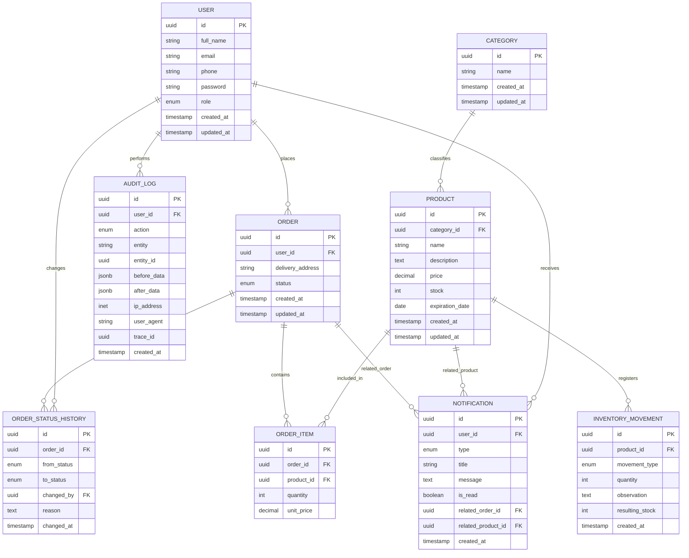

# 🏛️ Modelo Entidad-Relación (MER) — Home-Health

Este documento describe la estructura de datos del sistema **Home-Health**, diseñada a partir de las historias de usuario, criterios de aceptación y funcionalidades definidas para el MVP del proyecto.

El modelo está orientado a una arquitectura REST utilizando:

- PostgreSQL como sistema gestor de base de datos relacional
- Prisma ORM para la gestión de entidades y relaciones
- NestJS para la implementación del backend

El objetivo del MER es garantizar:

- Integridad de datos
- Escalabilidad
- Coherencia entre módulos
- Trazabilidad de pedidos e inventario

---

# 📌 Control de Versiones

| Versión | Fecha       | Descripción                                                                                                                                                                                          | Responsables                                      |
| :------ | :---------- | :--------------------------------------------------------------------------------------------------------------------------------------------------------------------------------------------------- | :------------------------------------------------ |
| 1.0     | 01/05/2026  | Definición inicial de entidades y relaciones del sistema.                                                                                                                                            | Sebastian Puentes, Karina Cantillo, Danay Pereira |
| 2.0     | 09/05/2026  | Refinamiento del MER alineado con historias de usuario, servicios REST y MVP del proyecto.                                                                                                           | Sebastian Puentes, Karina Cantillo, Danay Pereira |
| 2.1     | 10/05/2026  | Incorporación de la entidad `Category`, ajustes de relaciones, definición de consideraciones técnicas y alineación arquitectónica con el modelo de dominio.                                          | Sebastian Puentes, Karina Cantillo, Danay Pereira |
| 3.0     | 12/05/2026  | Incorporación de entidades `AuditLog`, `OrderStatusHistory`, `PasswordResetToken`. FK explícitas en `Notification` hacia `Order` y `Product`. Documentación formal de constraints CHECK, índices, normalización (3FN justificada), control de concurrencia con bloqueo pesimista y trigger nightly de verificación de stock. | Sebastian Puentes, Karina Cantillo, Danay Pereira |
| 3.1     | 20/05/2026  | Retiro de la entidad `PasswordResetToken` y la HU17 (recuperación de contraseña por correo) del alcance del MVP. La recuperación de acceso queda a cargo del administrador. Se eliminan también el constraint, el índice y la relación asociados.                                                                       | Sebastian Puentes, Karina Cantillo, Danay Pereira |

---

# 🚀 Arquitectura de Persistencia

El sistema utiliza una arquitectura relacional basada completamente en PostgreSQL debido a que el dominio del proyecto requiere:

- Integridad transaccional
- Relaciones estructuradas
- Consistencia en pedidos e inventario
- Validación de estados y trazabilidad

La arquitectura de persistencia se encuentra alineada con los servicios REST definidos en el sistema:

| Servicio | Entidades Relacionadas |
| :-- | :-- |
| Autenticación | User |
| Usuarios | User |
| Productos | Product, Category |
| Inventario | InventoryMovement |
| Pedidos | Order, OrderItem |
| Vencimientos | Product |
| Reportes | Consultas sobre múltiples entidades |
| Notificaciones | Notification |

---

# 🧩 Entidades del Sistema

## 1. User

Representa los usuarios autenticados del sistema.

| Campo | Tipo |
| :-- | :-- |
| id | UUID |
| full_name | VARCHAR |
| email | VARCHAR |
| phone | VARCHAR |
| password | VARCHAR |
| role | ENUM (CLIENT, ADMIN) |
| created_at | TIMESTAMP |
| updated_at | TIMESTAMP |

---

## 2. Category

Representa las categorías utilizadas para clasificar los medicamentos del catálogo.

| Campo | Tipo |
| :-- | :-- |
| id | UUID |
| name | VARCHAR |
| created_at | TIMESTAMP |
| updated_at | TIMESTAMP |

---

## 3. Product

Representa los medicamentos disponibles en el catálogo.

| Campo | Tipo |
| :-- | :-- |
| id | UUID |
| name | VARCHAR |
| category_id | UUID (FK) |
| description | TEXT |
| price | DECIMAL |
| stock | INTEGER |
| expiration_date | DATE |
| created_at | TIMESTAMP |
| updated_at | TIMESTAMP |

---

## 4. InventoryMovement

Registra entradas y salidas de inventario.

| Campo | Tipo |
| :-- | :-- |
| id | UUID |
| product_id | UUID (FK) |
| movement_type | ENUM (ENTRY, EXIT) |
| quantity | INTEGER |
| observation | TEXT |
| resulting_stock | INTEGER |
| created_at | TIMESTAMP |

---

## 5. Order

Representa los pedidos realizados por los clientes.

| Campo | Tipo |
| :-- | :-- |
| id | UUID |
| user_id | UUID (FK) |
| delivery_address | VARCHAR |
| status | ENUM (PENDING, PREPARING, ON_THE_WAY, DELIVERED, REJECTED) |
| created_at | TIMESTAMP |
| updated_at | TIMESTAMP |

---

## 6. OrderItem

Representa los productos contenidos dentro de un pedido.

| Campo | Tipo |
| :-- | :-- |
| id | UUID |
| order_id | UUID (FK) |
| product_id | UUID (FK) |
| quantity | INTEGER |
| unit_price | DECIMAL |

---

## 7. Notification

Representa las notificaciones internas del sistema. Cada notificación referencia opcionalmente la entidad fuente del evento (`Order` o `Product`) para evitar **eventos huérfanos** y permitir navegación directa desde la notificación al recurso.

| Campo            | Tipo                                                | Nulabilidad | Descripción                                              |
| :--------------- | :-------------------------------------------------- | :---------- | :------------------------------------------------------- |
| id               | UUID                                                | NOT NULL    | Identificador único.                                     |
| user_id          | UUID (FK → User.id)                                 | NOT NULL    | Usuario destinatario.                                    |
| type             | ENUM (LOW_STOCK, EXPIRATION, NEW_ORDER, STATE_CHANGE)| NOT NULL   | Tipo del evento.                                         |
| title            | VARCHAR(120)                                        | NOT NULL    | Título visible al usuario.                               |
| message          | TEXT                                                | NOT NULL    | Mensaje detallado.                                       |
| is_read          | BOOLEAN                                             | NOT NULL    | Marca leído/no leído (default FALSE).                    |
| related_order_id | UUID (FK → Order.id)                                | NULLABLE    | Pedido relacionado cuando aplica (NEW_ORDER, STATE_CHANGE). |
| related_product_id | UUID (FK → Product.id)                            | NULLABLE    | Producto relacionado cuando aplica (LOW_STOCK, EXPIRATION). |
| created_at       | TIMESTAMP                                           | NOT NULL    | Fecha y hora de creación.                                |

**Constraint adicional**: para garantizar que cada notificación tenga al menos una entidad fuente cuando aplique,

```sql
CONSTRAINT chk_notification_has_source CHECK (
  (type IN ('NEW_ORDER', 'STATE_CHANGE') AND related_order_id IS NOT NULL) OR
  (type IN ('LOW_STOCK', 'EXPIRATION')   AND related_product_id IS NOT NULL)
)
```

---

## 8. AuditLog

Entidad **crítica en dominio farmacéutico regulado** (Decreto 2200 de 2005, MinSalud Colombia). Registra cada acción significativa del sistema con trazabilidad completa de quién hizo qué, cuándo y desde dónde.

| Campo        | Tipo                                                                  | Nulabilidad | Descripción                                                                 |
| :----------- | :-------------------------------------------------------------------- | :---------- | :-------------------------------------------------------------------------- |
| id           | UUID                                                                  | NOT NULL    | Identificador único.                                                        |
| user_id      | UUID (FK → User.id ON DELETE SET NULL)                                | NULLABLE    | Usuario que ejecutó la acción (NULL si fue acción de sistema/cron).         |
| action       | ENUM (CREATE, UPDATE, DELETE, STATE_CHANGE, LOGIN, LOGOUT, EXPORT)    | NOT NULL    | Tipo de acción.                                                             |
| entity       | VARCHAR(50)                                                           | NOT NULL    | Nombre de la entidad afectada (`Product`, `Order`, `User`, etc.).           |
| entity_id    | UUID                                                                  | NULLABLE    | ID del registro afectado (NULL para acciones de LOGIN/LOGOUT/EXPORT globales). |
| before_data  | JSONB                                                                 | NULLABLE    | Snapshot del registro antes del cambio.                                     |
| after_data   | JSONB                                                                 | NULLABLE    | Snapshot del registro después del cambio.                                   |
| ip_address   | INET                                                                  | NULLABLE    | Dirección IP origen.                                                        |
| user_agent   | VARCHAR(255)                                                          | NULLABLE    | Navegador/cliente origen.                                                   |
| trace_id     | UUID                                                                  | NULLABLE    | ID de correlación para encadenar con CloudWatch Logs.                       |
| created_at   | TIMESTAMP                                                             | NOT NULL    | Fecha y hora exacta de la acción.                                           |

---

## 9. OrderStatusHistory

Entidad que materializa el historial de cambios de estado de un pedido. Resuelve la necesidad de timeline trazable exigida en HU10 y HU11 sin sobrecargar la entidad `Order`.

| Campo         | Tipo                                                                              | Nulabilidad | Descripción                                                           |
| :------------ | :-------------------------------------------------------------------------------- | :---------- | :-------------------------------------------------------------------- |
| id            | UUID                                                                              | NOT NULL    | Identificador único.                                                  |
| order_id      | UUID (FK → Order.id ON DELETE CASCADE)                                             | NOT NULL    | Pedido al que pertenece este registro.                                |
| from_status   | ENUM (PENDING, PREPARING, ON_THE_WAY, DELIVERED, REJECTED, CANCELLED)              | NULLABLE    | Estado anterior (NULL en la creación inicial).                        |
| to_status     | ENUM (PENDING, PREPARING, ON_THE_WAY, DELIVERED, REJECTED, CANCELLED)              | NOT NULL    | Estado nuevo tras la transición.                                      |
| changed_by    | UUID (FK → User.id)                                                                | NOT NULL    | Usuario que ejecutó el cambio.                                        |
| reason        | TEXT                                                                              | NULLABLE    | Observación opcional (ej. razón de rechazo o cancelación).            |
| changed_at    | TIMESTAMP                                                                          | NOT NULL    | Fecha y hora del cambio.                                              |

---

> **Nota**: la entidad `PasswordResetToken` y la HU17 (recuperación de contraseña por correo) fueron retiradas del alcance del MVP en la versión 3.1 del MER por dependencia de un servicio de correo transaccional externo. La recuperación de acceso se gestiona manualmente por el administrador.

---

# 🔗 Relaciones del Sistema

| Relación                              | Cardinalidad | Política ON DELETE        |
| :------------------------------------ | :----------- | :------------------------ |
| User → Order                          | 1:N          | RESTRICT                  |
| User → Notification                   | 1:N          | CASCADE                   |
| User → AuditLog                       | 1:N          | SET NULL                  |
| User → OrderStatusHistory (changed_by)| 1:N          | RESTRICT                  |
| Order → OrderItem                     | 1:N          | CASCADE                   |
| Order → OrderStatusHistory            | 1:N          | CASCADE                   |
| Order → Notification (related_order)  | 1:N          | SET NULL                  |
| Product → OrderItem                   | 1:N          | RESTRICT                  |
| Product → InventoryMovement           | 1:N          | RESTRICT                  |
| Product → Notification (related_product) | 1:N       | SET NULL                  |
| Category → Product                    | 1:N          | RESTRICT                  |

---

# 📊 Diagrama MER (Mermaid)



---

# 📐 Constraints CHECK (a nivel de motor)

Los siguientes constraints se aplican como **defensa en profundidad** a nivel de PostgreSQL, garantizando invariantes incluso si el código backend falla en validarlos:

| Entidad             | Constraint                                                      | Regla de negocio asociada |
| :------------------ | :-------------------------------------------------------------- | :------------------------ |
| `Product`           | `CHECK (stock >= 0)`                                            | RN02                      |
| `Product`           | `CHECK (price >= 0)`                                            | —                         |
| `Product`           | `CHECK (expiration_date > created_at)`                          | RN06                      |
| `OrderItem`         | `CHECK (quantity > 0)`                                          | —                         |
| `OrderItem`         | `CHECK (unit_price >= 0)`                                       | —                         |
| `InventoryMovement` | `CHECK (quantity > 0)`                                          | RN07                      |
| `InventoryMovement` | `CHECK (resulting_stock >= 0)`                                  | RN02                      |
| `Notification`      | `CHECK (...)` ver definición arriba                             | —                         |
| `User`              | `CHECK (email ~* '^[^@]+@[^@]+\.[^@]+$')`                       | —                         |

---

# 🔍 Índices

Los índices se documentan formalmente porque el profesor identificó su ausencia como una debilidad. Se justifican por los **queries de mayor frecuencia y volumen** del sistema.

| Índice                                                | Tabla                | Tipo    | Justificación                                                              |
| :---------------------------------------------------- | :------------------- | :------ | :------------------------------------------------------------------------- |
| `idx_user_email` (único)                              | `User`               | UNIQUE  | Login y validación de duplicados (HU01, HU02).                             |
| `idx_user_role`                                       | `User`               | BTREE   | Filtros de la pantalla de gestión de usuarios (HU05).                      |
| `idx_product_name`                                    | `Product`            | BTREE   | Búsqueda por nombre desde el catálogo (HU06).                              |
| `idx_product_category`                                | `Product`            | BTREE   | Filtro por categoría (HU06).                                               |
| `idx_product_expiration`                              | `Product`            | BTREE   | Listado de productos próximos a vencer (HU12).                             |
| `idx_order_user_status`                               | `Order`              | BTREE   | Listado de pedidos del cliente filtrado por estado (HU10, HU11).           |
| `idx_order_created_at_desc`                           | `Order`              | BTREE   | Ordenación de pedidos recientes en dashboard (HU11.dash).                  |
| `idx_orderitem_order`                                 | `OrderItem`          | BTREE   | JOIN principal con `Order` para hidratar detalles.                         |
| `idx_invmov_product_date`                             | `InventoryMovement`  | BTREE   | Historial de movimientos de un producto (HU08).                            |
| `idx_notification_user_read_date`                     | `Notification`       | BTREE   | Listado de notificaciones no leídas del admin (HU14).                      |
| `idx_audit_user_date`                                 | `AuditLog`           | BTREE   | Auditoría filtrada por usuario en investigaciones.                         |
| `idx_audit_entity_id`                                 | `AuditLog`           | BTREE   | Auditoría filtrada por recurso (ej. "qué pasó con el pedido X").           |
| `idx_status_history_order`                            | `OrderStatusHistory` | BTREE   | Reconstrucción del timeline de un pedido (HU10, HU11).                     |

---

# ⚡ Control de Concurrencia y Consistencia de Stock

## Justificación de redundancia controlada

El campo `Product.stock` mantiene el stock **actual** del producto y el campo `InventoryMovement.resulting_stock` registra el stock **resultante de cada movimiento histórico**. Esta redundancia es **intencional** y se justifica por:

1. **Lectura O(1) en catálogo**: mostrar el stock en la pantalla del catálogo (HU06) sin agregar todos los movimientos del producto, que sería O(N).
2. **Auditoría puntual**: cada `InventoryMovement` registra cuál era el stock en ese instante, permitiendo reconstruir el estado histórico sin reproyectar movimientos.

Sin embargo, esta redundancia **viola 3FN estricta** y debe formalizarse con un mecanismo de consistencia. Se aplican dos estrategias complementarias (ver ADR-012):

## Estrategia 1 — Transacción atómica con bloqueo pesimista

Toda operación que afecta el stock se ejecuta dentro de una transacción Prisma que:

1. Adquiere `SELECT ... FOR UPDATE` sobre la fila del producto.
2. Calcula el nuevo stock.
3. Valida invariantes (`stock >= 0`).
4. Actualiza `Product.stock` y crea `InventoryMovement` con `resulting_stock` calculado.
5. Inserta el registro correspondiente en `AuditLog`.
6. Commit.

Pseudocódigo (TypeScript / Prisma):

```ts
await prisma.$transaction(async (tx) => {
  const product = await tx.product.findUnique({
    where: { id: productId },
    select: { stock: true },
    // SELECT FOR UPDATE
    // (Prisma 5 lo configura con queryRaw o transaction options)
  });
  const newStock = product.stock + delta; // delta es + o -
  if (newStock < 0) throw new StockInsuficienteException();

  await tx.product.update({ where: { id: productId }, data: { stock: newStock } });
  await tx.inventoryMovement.create({
    data: { productId, quantity: Math.abs(delta), movementType, resultingStock: newStock }
  });
  await tx.auditLog.create({ data: { /* ... */ } });
});
```

## Estrategia 2 — Trigger nightly de verificación

Un job programado (NestJS Schedule) compara cada noche el `Product.stock` actual con la agregación `SUM(entradas) - SUM(salidas)` desde `InventoryMovement`. Si hay discrepancia:

```sql
WITH stock_calculado AS (
  SELECT
    product_id,
    SUM(CASE WHEN movement_type = 'ENTRY' THEN quantity ELSE -quantity END) AS stock_real
  FROM inventory_movement
  GROUP BY product_id
)
SELECT p.id, p.stock AS stock_persistido, sc.stock_real
FROM product p
JOIN stock_calculado sc ON sc.product_id = p.id
WHERE p.stock != sc.stock_real;
```

Cualquier discrepancia genera notificación de auditoría con `type = 'STOCK_INCONSISTENCY'` y registro en `AuditLog`.

---

# 📜 Normalización

El modelo está normalizado hasta **3FN** con la **excepción intencional y controlada** del campo `Product.stock` justificada arriba. Análisis por forma normal:

- **1FN**: todos los atributos son atómicos. No hay listas, JSON multi-valor ni grupos repetidos en columnas. ✅
- **2FN**: no hay dependencias parciales sobre claves compuestas porque todas las PKs son simples (UUID). ✅
- **3FN**: no hay dependencias transitivas. Cada atributo no clave depende **solo** de la clave primaria de su entidad. ✅ (Excepción: `Product.stock` depende del histórico de `InventoryMovement`, formalizada arriba como redundancia controlada).

`AuditLog.before_data` y `AuditLog.after_data` son **JSONB** porque su esquema varía dinámicamente según la entidad auditada; este uso de JSONB en datos diagnósticos es práctica estándar y no compromete la normalización del modelo operacional.

---

# 🩺 Trazabilidad regulatoria (Decreto 2200 de 2005)

El **Decreto 2200 de 2005** del Ministerio de Salud y Protección Social de Colombia exige a los servicios farmacéuticos llevar registros de:

| Requisito regulatorio                                                         | Cómo lo cubre el MER                                                                                  |
| :---------------------------------------------------------------------------- | :---------------------------------------------------------------------------------------------------- |
| Trazabilidad de cada medicamento (entrada, salida, lote, vencimiento)         | `InventoryMovement` con `product_id`, `quantity`, `movement_type`, `created_at`. `Product.expiration_date`. |
| Identificación del responsable de cada acción administrativa                   | `AuditLog.user_id` registra quién, `action` qué, `created_at` cuándo, `before/after_data` evidencia.   |
| Historial de cambios de estado en pedidos (despacho)                          | `OrderStatusHistory` con `from_status`, `to_status`, `changed_by`, `changed_at`.                       |
| Retención de información por mínimo cinco años                                 | Política de retención de la tabla `AuditLog` configurada en 6 años (5 + 1 buffer).                     |

---

# 🔒 Consideraciones de privacidad (Ley 1581 de 2012)

| Dato sensible                | Tratamiento                                                                                  |
| :--------------------------- | :------------------------------------------------------------------------------------------- |
| `User.password`              | Hasheada con bcrypt cost ≥ 12. Nunca se devuelve en respuestas API.                          |
| `User.email`, `User.phone`   | Solo accesibles a su propietario o al administrador con permisos explícitos.                  |
| `User.address` (en pedido)   | Almacenada por pedido (`Order.delivery_address`) no en perfil, para minimizar exposición.    |
| `AuditLog.before/after_data` | Se ofuscan campos sensibles (contraseñas, tokens) antes de serializar a JSONB.                |

---

# 📚 Referencias

- **Codd, E. F.** (1970). *A Relational Model of Data for Large Shared Data Banks*. Communications of the ACM. (Bases de la normalización).
- **Date, C. J.** (2003). *An Introduction to Database Systems* (8th ed.). Addison-Wesley. (3FN, BCNF).
- **Elmasri, R., & Navathe, S.** (2015). *Fundamentals of Database Systems* (7th ed.). Pearson.
- **Karwin, B.** (2010). *SQL Antipatterns: Avoiding the Pitfalls of Database Programming*. Pragmatic Bookshelf. (Sobre redundancia controlada y trade-offs).
- **Bernstein, P., & Newcomer, E.** (2009). *Principles of Transaction Processing* (2nd ed.). Morgan Kaufmann. (Bloqueo pesimista, control de concurrencia).
- **Ministerio de Salud y Protección Social.** (2005). *Decreto 2200 de 2005*. (Trazabilidad farmacéutica).
- **Congreso de la República de Colombia.** (2012). *Ley 1581 de 2012*. (Protección de datos personales).