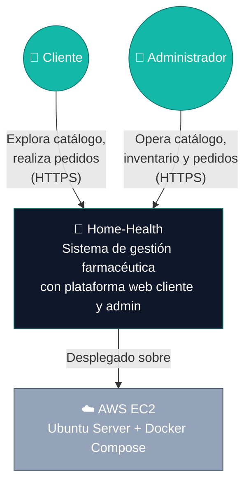
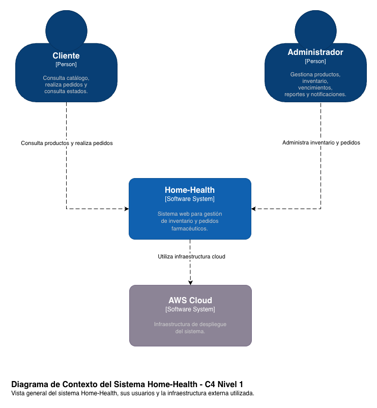
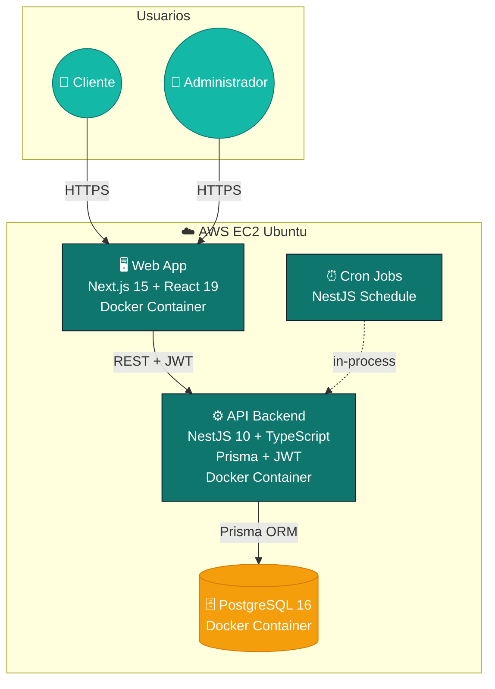
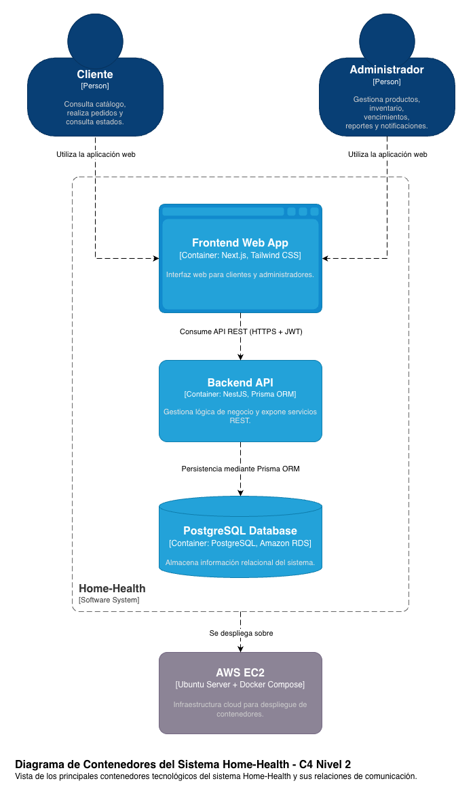
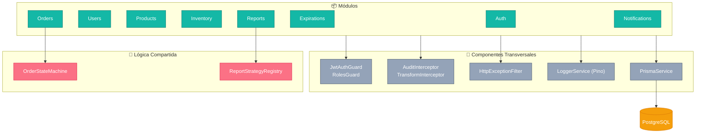
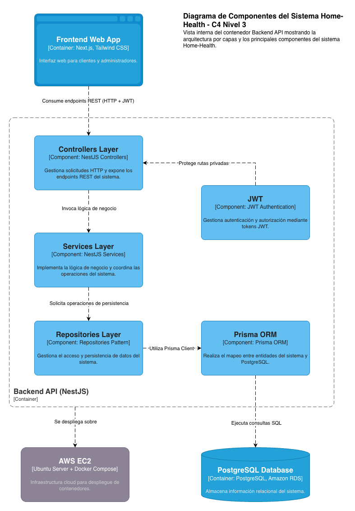

# Modelo C4 — Home-Health

## Control de Versiones

| Versión | Fecha       | Descripción                                                                                                | Responsables                                      |
| :------ | :---------- | :--------------------------------------------------------------------------------------------------------- | :------------------------------------------------ |
| 1.0     | 04/05/2026  | Diagramas C4 iniciales en draw.io.                                                                        | Sebastian Puentes, Karina Cantillo, Danay Pereira |
| 2.0     | 12/05/2026  | Reescritura como documento autocontenido con descripción textual por nivel y diagramas Mermaid verificables. | Sebastian Puentes, Karina Cantillo, Danay Pereira |
| 2.1     | 24/05/2026  | Actualización de arquitectura de despliegue: migración de AWS Lightsail a EC2 + Docker Compose.          | Sebastian Puentes, Karina Cantillo, Danay Pereira |

---

# 1. Marco Conceptual del Modelo C4

El **modelo C4**, propuesto por Simon Brown (2018) en *The C4 Model for Visualising Software Architecture*, describe la arquitectura de un sistema en **cuatro niveles progresivos de zoom**, cada uno dirigido a una audiencia distinta:

| Nivel  | Nombre          | Audiencia                                | Pregunta que responde                                                  |
| :----- | :-------------- | :--------------------------------------- | :--------------------------------------------------------------------- |
| **C1** | Contexto        | Stakeholders no técnicos, gerencia       | ¿Qué hace el sistema y quién interactúa con él?                        |
| **C2** | Contenedores    | Arquitectos, devops, equipo técnico      | ¿Cuáles son las piezas tecnológicas desplegables y cómo se conectan?   |
| **C3** | Componentes     | Equipo de desarrollo del contenedor      | ¿Cómo está estructurado internamente cada contenedor?                  |
| **C4** | Código (clases) | Desarrollador individual                 | ¿Cómo se implementan los componentes? *(Opcional, generalmente en IDE)* |

Cada nivel debe ser **verificable**: el lector debe poder reconstruir mentalmente el sistema y validar coherencia con el código real. Por eso este documento incluye, en cada nivel, los **elementos**, las **relaciones**, las **tecnologías** y las **responsabilidades**, además del diagrama visual.

> **Convención del proyecto**: este documento usa diagramas Mermaid embebidos (renderizados nativamente en GitHub/GitLab/VSCode) como **fuente primaria verificable**. Las imágenes de draw.io en `docs/imagenes/` son **respaldo visual** complementario y representan los mismos elementos.

---

# 2. Nivel 1 — Diagrama de Contexto (C1)

## 2.1 Objetivo

Mostrar Home-Health como una "caja negra" dentro de su ecosistema: qué tipo de usuarios lo usan y sobre qué infraestructura se ejecuta.

## 2.2 Elementos

| Elemento              | Tipo            | Descripción                                                                 |
| :-------------------- | :-------------- | :-------------------------------------------------------------------------- |
| **Cliente**           | Persona         | Usuario final que adquiere medicamentos a domicilio.                        |
| **Administrador**     | Persona         | Personal de la farmacia que opera catálogo, inventario, pedidos y reportes. |
| **Home-Health**       | Sistema (foco)  | Plataforma web de gestión farmacéutica con cliente público y panel admin.   |
| **AWS EC2**           | Infraestructura | Instancia Ubuntu donde se ejecuta Docker Compose con todos los servicios.   |

## 2.3 Relaciones principales

| Origen        | Destino      | Descripción                                       | Protocolo / Tecnología |
| :------------ | :----------- | :------------------------------------------------ | :--------------------- |
| Cliente       | Home-Health  | Explora catálogo, realiza y consulta pedidos      | HTTPS                  |
| Administrador | Home-Health  | Gestiona catálogo, inventario y pedidos           | HTTPS                  |
| Home-Health   | AWS EC2      | Ejecuta frontend, backend y base de datos         | Docker Compose         |

## 2.4 Diagrama C1



📎 **Diagrama de respaldo (draw.io)**: 

---

# 3. Nivel 2 — Diagrama de Contenedores (C2)

## 3.1 Objetivo

Hacer zoom dentro de Home-Health para mostrar las piezas tecnológicas ejecutadas dentro del stack Docker Compose y sus protocolos de comunicación.

## 3.2 Contenedores

| Contenedor        | Tecnología                       | Responsabilidad                                                                 | Despliegue                                |
| :---------------- | :------------------------------- | :------------------------------------------------------------------------------ | :---------------------------------------- |
| **Web App**       | Next.js 15 + React 19 + Tailwind | Render SSR y client-side; consume API REST; persiste JWT en localStorage.      | Contenedor Docker ejecutado en EC2 Ubuntu |
| **API Backend**   | NestJS 10 + TypeScript           | API REST, autenticación JWT, lógica de dominio, validaciones y transacciones.  | Contenedor Docker ejecutado en EC2 Ubuntu |
| **Base de Datos** | PostgreSQL 16                    | Persistencia relacional con constraints CHECK, índices y transacciones.         | Contenedor Docker PostgreSQL en EC2       |
| **Cron / Jobs**   | NestJS Schedule module           | Verificación de stock, recordatorios de vencimiento y limpieza de registros.    | Embebido en API Backend                   |

## 3.3 Relaciones

| Origen          | Destino         | Protocolo         | Descripción                                            |
| :-------------- | :---------------| :---------------- | :----------------------------------------------------- |
| Cliente / Admin | Web App         | HTTPS             | Navegador web                                          |
| Web App         | API Backend     | HTTPS + JSON      | API REST con Bearer JWT                                |
| API Backend     | Base de Datos   | TCP / Puerto 5432 | Prisma ORM                                             |
| API Backend     | Docker Logs     | stdout / stderr   | Logging estructurado accesible vía docker compose logs |

## 3.4 Diagrama C2



📎 **Diagrama de respaldo (draw.io)**: 

---

# 4. Nivel 3 — Diagrama de Componentes (C3)

## 4.1 Objetivo

Hacer zoom dentro del **API Backend** para mostrar la organización interna por módulos siguiendo Clean Architecture (ADR-001) y los flujos de invocación entre capas.

## 4.2 Estructura modular del backend

El backend está organizado en módulos funcionales alineados con los servicios REST del sistema:

| # | Módulo | Responsabilidad |
| :- | :----- | :-------------- |
| 1 | **Auth** | Registro, login y autenticación JWT |
| 2 | **Users** | Gestión de usuarios |
| 3 | **Products** | Catálogo de medicamentos |
| 4 | **Inventory** | Movimientos de stock |
| 5 | **Orders** | Gestión del ciclo de vida de pedidos |
| 6 | **Expirations** | Productos próximos a vencer |
| 7 | **Reports** | Reportes PDF/Excel/CSV |
| 8 | **Notifications** | Centro de notificaciones |

## 4.3 Capas internas

```text
módulo/
├── controller.ts
├── service.ts
├── repository.ts
└── dto/
```

## 4.4 Componentes transversales

| Componente | Responsabilidad |
| :---------- | :--------------- |
| **JwtAuthGuard** | Valida JWT |
| **RolesGuard** | Restringe acceso ADMIN |
| **AuditInterceptor** | Registra eventos críticos |
| **TransformInterceptor** | Normaliza respuestas |
| **HttpExceptionFilter** | Manejo centralizado de errores |
| **PrismaService** | Cliente Prisma compartido |
| **LoggerService (Pino)** | Logging estructurado |
| **OrderStateMachine** | Máquina de estados pedidos |
| **ReportStrategyRegistry** | Estrategias de reportes |

## 4.5 Diagrama C3



📎 **Diagrama de respaldo (draw.io)**: 

---

# 5. Atributos de Calidad Direccionados

| Atributo de calidad | Cómo lo aborda la arquitectura |
| :------------------ | :----------------------------- |
| **Modificabilidad** | Modularización por dominio + Clean Architecture |
| **Mantenibilidad** | TypeScript + Prisma ORM |
| **Seguridad** | JWT + Guards + bcrypt |
| **Confiabilidad** | Transacciones + constraints CHECK |
| **Testabilidad** | Pirámide de pruebas |
| **Observabilidad** | Logging estructurado + docker compose logs |
| **Deployabilidad** | Docker Compose sobre EC2 |

---

# 6. Referencias

- Brown, S. (2018). *The C4 Model for Visualising Software Architecture*. Leanpub. https://c4model.com
- Bass, L., Clements, P., & Kazman, R. (2021). *Software Architecture in Practice* (4th ed.). Addison-Wesley.
- Martin, R. C. (2017). *Clean Architecture: A Craftsman's Guide to Software Structure and Design*. Prentice Hall.
- Fowler, M. (2002). *Patterns of Enterprise Application Architecture*. Addison-Wesley.
- Richardson, C. (2018). *Microservices Patterns*. Manning.
- Evans, E. (2003). *Domain-Driven Design: Tackling Complexity in the Heart of Software*. Addison-Wesley.

