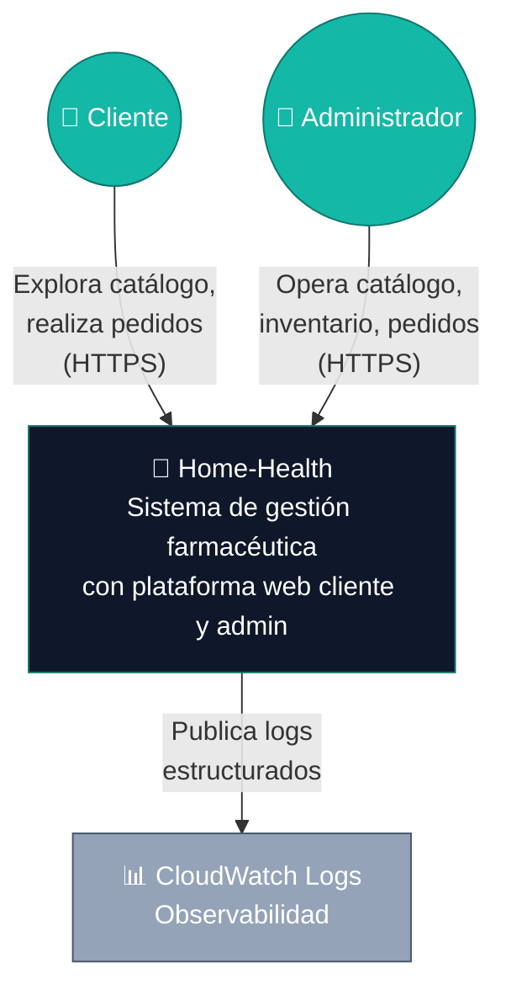
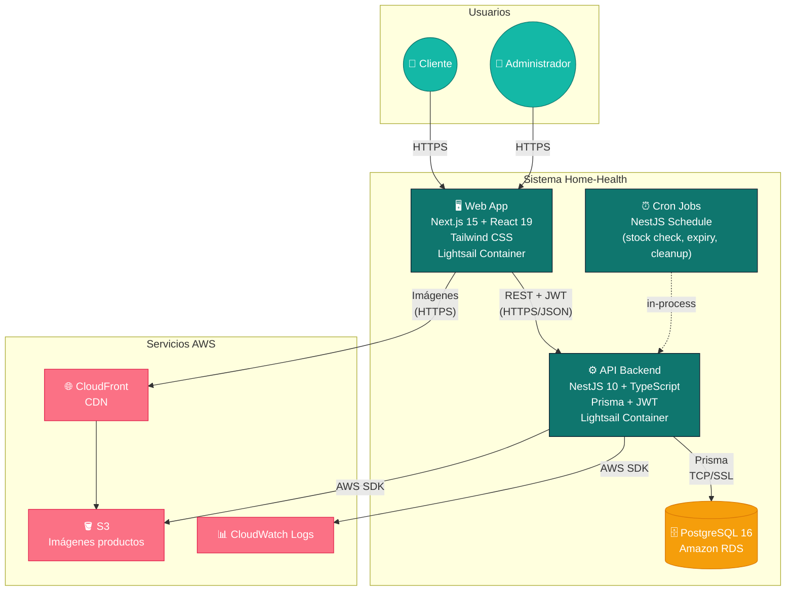
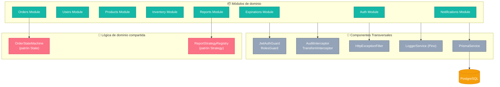
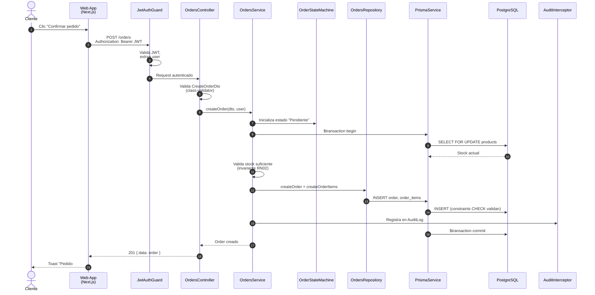

# Modelo C4 — Home-Health

## Control de Versiones

| Versión | Fecha       | Descripción                                                                                                | Responsables                                      |
| :------ | :---------- | :--------------------------------------------------------------------------------------------------------- | :------------------------------------------------ |
| 1.0     | 04/05/2026  | Diagramas C4 iniciales en draw.io.                                                                          | Sebastian Puentes, Karina Cantillo, Danay Pereira |
| 2.0     | 12/05/2026  | Reescritura como documento autocontenido con descripción textual por nivel y diagramas Mermaid verificables. | Sebastian Puentes, Karina Cantillo, Danay Pereira |

---

## 1. Marco Conceptual del Modelo C4

El **modelo C4**, propuesto por Simon Brown (2018) en *The C4 Model for Visualising Software Architecture*, describe la arquitectura de un sistema en **cuatro niveles progresivos de zoom**, cada uno dirigido a una audiencia distinta:

| Nivel  | Nombre          | Audiencia                                | Pregunta que responde                                                  |
| :----- | :-------------- | :--------------------------------------- | :--------------------------------------------------------------------- |
| **C1** | Contexto        | Stakeholders no técnicos, gerencia       | ¿Qué hace el sistema y quién interactúa con él?                        |
| **C2** | Contenedores    | Arquitectos, devops, equipo técnico      | ¿Cuáles son las piezas tecnológicas desplegables y cómo se conectan?   |
| **C3** | Componentes     | Equipo de desarrollo del contenedor      | ¿Cómo está estructurado internamente cada contenedor?                  |
| **C4** | Código (clases) | Desarrollador individual                 | ¿Cómo se implementan los componentes? *(Opcional, generalmente en IDE)* |

Cada nivel debe ser **verificable**: el lector debe poder reconstruir mentalmente el sistema y validar coherencia con el código real. Por eso este documento incluye, en cada nivel, los **elementos**, las **relaciones**, las **tecnologías** y las **responsabilidades**, además del diagrama visual.

> **Convención del proyecto**: este documento usa diagramas Mermaid embebidos (renderizados nativamente en GitHub/GitLab/VSCode) como **fuente primaria verificable**. Las imágenes de draw.io en `docs/imagenes/` son **respaldo visual** complementario y representan los mismos elementos.

---

## 2. Nivel 1 — Diagrama de Contexto (C1)

### 2.1 Objetivo

Mostrar Home-Health como una "caja negra" dentro de su ecosistema: qué tipo de usuarios lo usan y qué sistemas externos consume o expone.

### 2.2 Elementos

| Elemento                    | Tipo            | Descripción                                                                                              |
| :-------------------------- | :-------------- | :------------------------------------------------------------------------------------------------------- |
| **Cliente**                 | Persona         | Usuario final que adquiere medicamentos a domicilio.                                                     |
| **Administrador**           | Persona         | Personal de la farmacia que opera catálogo, inventario, pedidos, vencimientos y reportes.                |
| **Home-Health**             | Sistema (foco)  | Plataforma web de gestión farmacéutica con cliente público y panel administrativo.                       |
| **Amazon CloudWatch Logs**  | Sistema externo | Recolección de logs estructurados y métricas básicas del backend.                                        |

### 2.3 Relaciones principales

| Origen        | Destino           | Descripción                                       | Protocolo / Tecnología |
| :------------ | :---------------- | :------------------------------------------------ | :--------------------- |
| Cliente       | Home-Health       | Explora catálogo, realiza y consulta pedidos      | HTTPS                  |
| Administrador | Home-Health       | Gestiona catálogo, inventario y pedidos           | HTTPS                  |
| Home-Health   | CloudWatch Logs   | Publica logs estructurados de cada operación      | AWS SDK                |

### 2.4 Diagrama C1



📎 **Diagrama de respaldo (draw.io)**: 

---

## 3. Nivel 2 — Diagrama de Contenedores (C2)

### 3.1 Objetivo

Hacer zoom dentro de Home-Health para mostrar las **piezas tecnológicas desplegables** (contenedores) y sus protocolos de comunicación. Cada contenedor es algo que se despliega de forma independiente (proceso, base de datos, servicio gestionado).

### 3.2 Contenedores

| Contenedor              | Tecnología                      | Responsabilidad                                                                                                 | Despliegue                       |
| :---------------------- | :------------------------------ | :-------------------------------------------------------------------------------------------------------------- | :------------------------------- |
| **Web App**             | Next.js 15 + React 19 + Tailwind | Render SSR y client-side; rutas `(auth)`, `(client)`, `admin`; consume API REST; persiste token JWT en localStorage. | AWS Lightsail Container          |
| **API Backend**         | NestJS 10 + TypeScript          | API REST, autenticación JWT, lógica de dominio, transacciones, validaciones, audit logging.                     | AWS Lightsail Container          |
| **Base de Datos**       | PostgreSQL 16                   | Persistencia relacional con integridad referencial, transacciones, constraints CHECK e índices.                 | Amazon RDS                       |
| **Almacenamiento Imágenes** | Amazon S3                  | Imágenes de productos del catálogo subidas por el admin.                                                        | Amazon S3 (bucket privado + signed URLs) |
| **CDN / Edge**          | Amazon CloudFront               | Distribución global de assets estáticos y caching.                                                              | AWS CloudFront                   |
| **Cron / Jobs**         | NestJS Schedule module          | Trabajos programados: detector de inconsistencias de stock, recordatorios de vencimiento, limpieza AuditLog.    | Embebido en API Backend          |

### 3.3 Relaciones

| Origen         | Destino                | Protocolo               | Descripción                                                       |
| :------------- | :--------------------- | :---------------------- | :---------------------------------------------------------------- |
| Cliente / Admin| Web App                | HTTPS                   | Navegador HTTP/2                                                  |
| Web App        | API Backend            | HTTPS + JSON            | API REST con Bearer JWT en cada request                           |
| API Backend    | Base de Datos          | TCP / SSL (puerto 5432) | Cliente Prisma con pool de conexiones                             |
| API Backend    | Almacenamiento S3      | HTTPS (AWS SDK v3)      | Upload de imágenes y generación de presigned URLs                 |
| API Backend    | CloudWatch Logs        | HTTPS (AWS SDK v3)      | Logs estructurados en JSON                                        |
| Web App        | CloudFront             | HTTPS                   | Imágenes optimizadas vía CDN                                      |
| CloudFront     | S3                     | HTTPS                   | Origin para imágenes                                              |

### 3.4 Diagrama C2



📎 **Diagrama de respaldo (draw.io)**: 

---

## 4. Nivel 3 — Diagrama de Componentes (C3)

### 4.1 Objetivo

Hacer zoom dentro del **API Backend** para mostrar la organización interna por módulos siguiendo Clean Architecture (ver ADR-001) y los flujos de invocación entre capas.

### 4.2 Estructura modular del backend

El backend está organizado en **8 módulos funcionales** alineados con los servicios REST mínimos exigidos por el proyecto:

| # | Módulo          | Endpoints principales                              | Responsabilidad                                              |
| :- | :-------------- | :------------------------------------------------- | :----------------------------------------------------------- |
| 1 | **Auth**        | `POST /auth/register`, `/login`, `/logout`                      | Registro, login y cierre de sesión con JWT |
| 2 | **Users**       | `GET/PATCH /users`, `/users/me`                    | Gestión de usuarios y perfiles                                |
| 3 | **Products**    | `GET/POST/PATCH/DELETE /products`                  | Catálogo de medicamentos                                      |
| 4 | **Inventory**   | `POST /inventory/movements`, `GET /inventory`      | Movimientos de stock (entradas y salidas)                     |
| 5 | **Orders**      | `POST/GET/PATCH /orders`                           | Ciclo de vida de pedidos con máquina de estados               |
| 6 | **Expirations** | `GET /products/expiring`                           | Productos próximos a vencer o vencidos                        |
| 7 | **Reports**     | `GET /reports/{type}`                              | Reportes con Strategy + exportación PDF/Excel/CSV             |
| 8 | **Notifications** | `GET/PATCH /notifications`                       | Centro de notificaciones del sistema                          |

### 4.3 Capas internas (por módulo)

Siguiendo Clean Architecture (Martin, 2017), cada módulo replica la misma estructura de cuatro capas:

```
módulo/
├── controller.ts       ← Recibe HTTP, valida DTO, devuelve HTTP
├── service.ts          ← Lógica de negocio, transacciones, reglas
├── repository.ts       ← Acceso a datos vía Prisma
└── dto/                ← Data Transfer Objects con validación class-validator
```

### 4.4 Componentes transversales (cross-cutting concerns)

| Componente                | Responsabilidad                                                                       |
| :------------------------ | :------------------------------------------------------------------------------------ |
| **JwtAuthGuard**          | Valida JWT en cada request protegido y adjunta el `user` al contexto.                 |
| **RolesGuard**            | Restringe endpoints `/admin/*` al rol ADMIN.                                          |
| **AuditInterceptor**      | Registra en AuditLog acciones críticas (CREATE/UPDATE/DELETE/STATE_CHANGE/LOGIN).     |
| **TransformInterceptor**  | Normaliza la respuesta `{ data, meta }`.                                              |
| **HttpExceptionFilter**   | Convierte excepciones de dominio en respuestas HTTP con `traceId`.                    |
| **PrismaService**         | Cliente Prisma compartido con configuración de pool y logging.                        |
| **LoggerService (Pino)**  | Logging estructurado JSON con `traceId`, `userId`, `module`, `action`.                |
| **OrderStateMachine**     | Encapsula transiciones válidas del pedido (patrón State, ver ADR-007).                |
| **ReportStrategyRegistry**| Mapa `ReportType → IReportStrategy<T>` (patrón Strategy, ver ADR-007).                |

### 4.5 Diagrama C3



📎 **Diagrama de respaldo (draw.io)**: 

### 4.6 Flujo de invocación típico: confirmar pedido

Para ilustrar la interacción entre componentes, este diagrama de secuencia muestra el flujo completo de `POST /orders` (HU09 — Crear pedido):



---

## 5. Atributos de Calidad Direccionados

Cada decisión arquitectónica reflejada en los diagramas C4 atiende un **atributo de calidad** específico (Bass et al., 2021):

| Atributo de calidad | Cómo lo aborda la arquitectura                                                                |
| :------------------ | :-------------------------------------------------------------------------------------------- |
| **Modificabilidad** | Modularización por dominio + Clean Architecture (ADR-001) + patrones Strategy/State (ADR-007) |
| **Mantenibilidad**  | TypeScript end-to-end, type-safety con Prisma (ADR-005), CI con type-check (ADR-010)          |
| **Seguridad**       | JWT (ADR-003) + Guards + audit trail (ADR-009, ADR-011) + bcrypt para contraseñas              |
| **Confiabilidad**   | Transacciones (ADR-002, ADR-012) + máquina de estados + constraints CHECK (ADR-011)            |
| **Testabilidad**    | Pirámide de pruebas en 3 niveles (ADR-008)                                                    |
| **Observabilidad**  | Logging estructurado + health checks + AuditLog (ADR-009)                                     |
| **Deployabilidad**  | Containers Docker (ADR-004) + pipeline CI/CD (ADR-010)                                        |

---

## 6. Referencias

- Brown, S. (2018). *The C4 Model for Visualising Software Architecture*. Leanpub. https://c4model.com
- Bass, L., Clements, P., & Kazman, R. (2021). *Software Architecture in Practice* (4th ed.). Addison-Wesley.
- Martin, R. C. (2017). *Clean Architecture: A Craftsman's Guide to Software Structure and Design*. Prentice Hall.
- Fowler, M. (2002). *Patterns of Enterprise Application Architecture*. Addison-Wesley.
- Richardson, C. (2018). *Microservices Patterns*. Manning.
- Evans, E. (2003). *Domain-Driven Design: Tackling Complexity in the Heart of Software*. Addison-Wesley.
