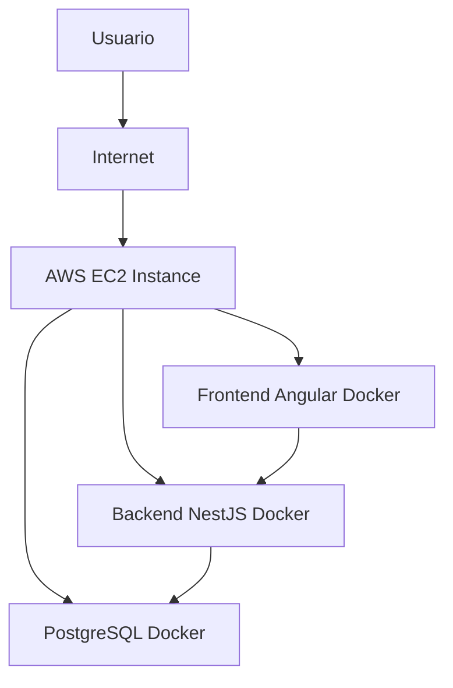

# Infraestructura AWS — Home-Health

## Introducción

Este documento describe la arquitectura de infraestructura en AWS utilizada para el despliegue del sistema **Home-Health**, una plataforma de gestión farmacéutica.

La arquitectura está diseñada bajo un enfoque de **contenedorización con Docker**, desplegada en una instancia **Amazon EC2**, garantizando simplicidad, escalabilidad básica y bajo costo para un entorno académico.

---

# Arquitectura General

El sistema está compuesto por tres capas principales:

- Frontend (Angular)
- Backend (NestJS API)
- Base de datos (PostgreSQL)

Todas las capas se ejecutan dentro de contenedores Docker administrados mediante Docker Compose.

---

## Diagrama de arquitectura



---

# Servicios AWS utilizados

## 1. Amazon EC2

### Descripción

Se utiliza una instancia EC2 como servidor principal donde se ejecuta toda la aplicación.

### Configuración:

* Sistema operativo: Ubuntu Server 22.04 LTS
* Tipo de instancia: t2.micro / t3.micro (free tier si aplica)
* Acceso: SSH (puerto 22)
* Docker instalado para orquestación de contenedores

### Función:

* Hospedar backend, frontend y base de datos en contenedores
* Servir como servidor único del sistema

---

## 2. Security Groups (Firewall)

Se configura un grupo de seguridad para controlar el tráfico de red.

### Reglas de entrada:

| Servicio | Puerto | Protocolo | Origen    | Descripción    |
| -------- | ------ | --------- | --------- | -------------- |
| SSH      | 22     | TCP       | 0.0.0.0/0 | Acceso remoto  |
| Frontend | 4200   | TCP       | 0.0.0.0/0 | Aplicación web |
| Backend  | 8080   | TCP       | 0.0.0.0/0 | API REST       |

> Nota: PostgreSQL NO está expuesto públicamente por seguridad.

---

## 3. Amazon EBS (Storage)

### Descripción

El almacenamiento de la instancia EC2 se gestiona mediante EBS.

### Uso:

* Sistema operativo
* Código fuente clonado desde GitHub
* Volúmenes Docker (persistencia de PostgreSQL)

---

## 4. Red (VPC por defecto)

La infraestructura utiliza la VPC por defecto de AWS:

* Subred pública para EC2
* IP pública asignada automáticamente
* Acceso directo mediante Internet Gateway

---

# Contenerización (Docker)

El sistema se despliega mediante Docker Compose con tres servicios:

## Servicios:

### 1. Frontend

* Framework: Angular
* Puerto: 4200
* Servido vía Nginx dentro del contenedor

---

### 2. Backend

* Framework: NestJS
* Puerto: 8080
* API REST principal del sistema

---

### 3. Base de datos

* Motor: PostgreSQL 16
* Puerto interno: 5432
* Persistencia mediante volumen Docker

---

## docker-compose.yml (resumen)

```yaml
services:
  db:
    image: postgres:16

  backend:
    build: ./backend
    ports:
      - "8080:8080"

  frontend:
    build: ./frontend
    ports:
      - "4200:80"
```

---

# Despliegue del sistema

## Flujo de despliegue

1. Crear instancia EC2
2. Configurar Security Group
3. Conectarse vía SSH
4. Instalar Docker y Docker Compose
5. Clonar repositorio desde GitHub
6. Ejecutar:

```bash
docker compose up -d --build
```

7. Validar contenedores activos:

```bash
docker ps
```

---

# Seguridad de la infraestructura

## Medidas aplicadas:

* Acceso SSH restringido (puerto 22)
* Separación de servicios por contenedores
* Base de datos no expuesta públicamente
* Variables de entorno para secretos (JWT, DB credentials)
* Uso de Docker network interna

---

## Riesgos mitigados:

| Riesgo               | Solución                |
| -------------------- | ----------------------- |
| Exposición de DB     | Puerto no público       |
| Acceso no autorizado | Security Groups         |
| Fuga de secretos     | Variables de entorno    |
| Caída de servicios   | Docker restart policies |

---

# Escalabilidad (limitada)

Aunque la arquitectura es monolítica en EC2, permite:

* Escalado vertical (upgrade de instancia)
* Migración futura a ECS o Kubernetes
* Separación de servicios en microservicios

---

# Consideraciones de costos

## Servicios usados:

| Servicio               | Costo aproximado                        |
| ---------------------- | --------------------------------------- |
| EC2 t2.micro           | Gratis (Free Tier) o bajo costo mensual |
| EBS (8–30GB)           | Bajo costo mensual                      |
| Transferencia de datos | Variable (bajo en entorno académico)    |

Este proyecto está optimizado para **bajo costo académico**.

---

# Conclusión

La infraestructura implementada en AWS cumple con los objetivos del sistema:

✔ Despliegue funcional en la nube

✔ Arquitectura basada en contenedores

✔ Separación de responsabilidades por servicios

✔ Seguridad básica mediante Security Groups

✔ Persistencia de datos en volumen Docker

Esta arquitectura es adecuada para un entorno académico y puede evolucionar hacia soluciones escalables en producción como ECS, EKS o arquitectura serverless.


