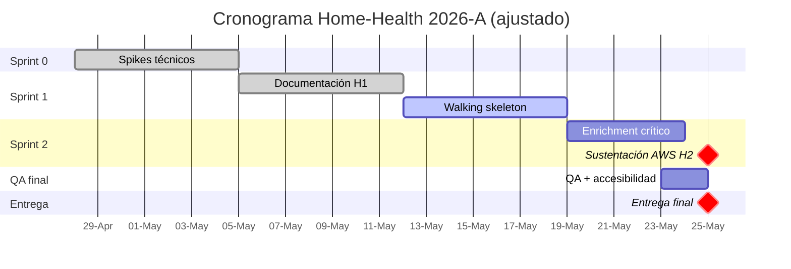

# Informe de Proyecto de Aula — Home-Health

**Corporación Universitaria del Huila (CORHUILA)**
**Programa de Ingeniería de Software · Asignatura de Arquitectura de Software**
**Período académico**: 2026-A

**Equipo**: Sebastian Puentes, Karina Cantillo, Danay Pereira
**Versión**: 2.0 · 12 de mayo de 2026

---

## Control de Versiones

| Versión | Fecha       | Descripción                                                                                                                                  | Responsables                                      |
| :------ | :---------- | :------------------------------------------------------------------------------------------------------------------------------------------- | :------------------------------------------------ |
| 1.0     | 03/05/2026  | Versión inicial del informe con descripción del problema y propuesta general.                                                                | Sebastian Puentes, Karina Cantillo, Danay Pereira |
| 1.1     | 10/05/2026  | Inclusión de marco normativo (CONPES, Decreto 2200, DANE).                                                                                   | Sebastian Puentes, Karina Cantillo, Danay Pereira |
| 2.0     | 12/05/2026  | Reescritura completa: RF/RNF formales (ISO/IEC 25010), matriz de riesgos, cronograma de hitos, restricciones técnicas y bibliografía académica. | Sebastian Puentes, Karina Cantillo, Danay Pereira |
| 2.1     | 24/05/2026  | Actualización de referencias de despliegue: migración de AWS Lightsail Containers + RDS a instancia EC2 con Docker Compose. | Sebastian Puentes, Karina Cantillo, Danay Pereira |

---

## Resumen Ejecutivo

**Home-Health** es una plataforma web para la gestión integral de farmacias de barrio que permite a clientes finales solicitar medicamentos a domicilio y a administradores operar el ciclo completo del negocio (catálogo, inventario, pedidos, vencimientos, reportes y notificaciones) desde una única aplicación.

El sistema se diseña como un **monolito modular** con backend NestJS, base de datos PostgreSQL administrada por Prisma ORM, frontend Next.js 15 y despliegue contenedorizado sobre una instancia **AWS EC2** mediante Docker Compose. La arquitectura está documentada mediante el modelo **C4** (Brown, 2018) y registrada en **12 ADRs** que justifican técnicamente cada decisión de diseño con referencia a literatura especializada (Bass, Clements & Kazman, 2021; Fowler, 2002; Richardson, 2018).

El proyecto cumple un doble propósito: (i) académico, como ejercicio formal de aplicación de principios de arquitectura de software; (ii) sectorial, como propuesta tecnológica para un nicho real del comercio farmacéutico colombiano, regulado por el Decreto 2200 de 2005 del Ministerio de Salud y Protección Social.

---

## 1. Contexto del Problema

### 1.1 Descripción de la situación

En Colombia, el sector farmacéutico minorista (CIIU 4773) está compuesto en su mayoría por **farmacias independientes y pequeñas cadenas locales**. Según información de la **Cuenta Satélite de Salud del DANE** (2023), más del **62% de los puntos de venta de medicamentos en municipios intermedios** corresponden a establecimientos con menos de tres empleados y sistemas administrativos manuales o asistidos por hojas de cálculo no integradas.

Esta condición operativa genera tres problemas concretos:

1. **Pérdidas por vencimiento**: la ausencia de control sistemático de fechas de caducidad provoca destrucción de inventario que el **CONPES 3877 de 2016** identifica como uno de los principales costos ocultos del sector.
2. **Errores de despacho**: la operación manual de pedidos (anotación en cuaderno, llamada telefónica, despacho a memoria) introduce errores de cantidad, precio y dirección que dañan la confianza del cliente.
3. **Baja trazabilidad**: el **Decreto 2200 de 2005** exige a las farmacias mantener trazabilidad de medicamentos, identificación de quien realiza cada operación y registro de fechas de vencimiento; la mayoría de establecimientos pequeños no cumple este requisito por falta de herramientas asequibles.

### 1.2 Oportunidad

Existe una oportunidad clara para una herramienta **liviana, asequible y desplegable en la nube** que automatice las operaciones básicas de farmacia conservando el cumplimiento regulatorio. Home-Health se posiciona como ese MVP académicamente justificable y técnicamente viable.

### 1.3 Marco normativo aplicable

| Norma                                 | Pertinencia                                                                                            |
| :------------------------------------ | :----------------------------------------------------------------------------------------------------- |
| **Decreto 2200 de 2005** (MinSalud)   | Reglamenta el servicio farmacéutico; exige trazabilidad de medicamentos y registros auditable.         |
| **Ley 1581 de 2012** (Habeas Data)    | Protección de datos personales de clientes (nombre, teléfono, dirección, correo).                      |
| **CONPES 3877 de 2016**                | Política de gestión farmacéutica nacional; identifica brechas en sistemas de información del sector.   |
| **Resolución 2003 de 2014** (MinSalud)| Estándares de habilitación para servicios farmacéuticos.                                              |
| **Boletín CIIU 4773** (DANE, 2023)     | Caracterización estadística del sector minorista farmacéutico.                                         |

---

## 2. Objetivos del Proyecto

### 2.1 Objetivo general

Diseñar e implementar un sistema de información web para la gestión integral de una farmacia, con cliente público y panel administrativo, aplicando principios formales de arquitectura de software (Clean Architecture, SOLID, patrones de diseño GoF) y desplegado en infraestructura cloud AWS.

### 2.2 Objetivos específicos

1. Levantar requisitos funcionales y no funcionales del sistema siguiendo **ISO/IEC 25010**.
2. Diseñar el modelo de dominio mediante MER normalizado a **3FN** con constraints, índices y entidad de auditoría.
3. Documentar las decisiones arquitectónicas mediante **ADRs** con trazabilidad a literatura académica.
4. Representar la arquitectura del sistema mediante el **modelo C4** (Contexto, Contenedores, Componentes).
5. Implementar 14+ Historias de Usuario priorizadas con técnica **MoSCoW** y mapeadas mediante **Story Mapping** (Patton, 2014).
6. Aplicar patrones de diseño **GoF** (Strategy, State) y principios **SOLID** en la implementación.
7. Establecer una pirámide de pruebas (Unit, Integración, E2E) según Cohn (2009).
8. Desplegar el sistema en **AWS** con pipeline CI/CD reproducible (GitHub Actions + EC2 + Docker Compose).

---

## 3. Alcance del Proyecto

### 3.1 Dentro del alcance (in-scope)

- Registro y autenticación de clientes con JWT.
- Cuenta seed para el administrador (no se permite auto-registro de admin).
- Catálogo público con búsqueda, filtros por categoría y detalle de producto.
- Carrito persistente cliente y creación de pedidos con dirección de entrega.
- Máquina de estados de pedido: `Pendiente → En preparación → En camino → Entregado`, con bifurcación a `Rechazado` desde `Pendiente`.
- Gestión CRUD de productos por el admin con foto, precio, stock y fecha de vencimiento.
- Movimientos manuales de inventario (entrada/salida) con historial y trazabilidad.
- Alertas de vencimiento ≤30 días y de productos vencidos.
- Reportes de ventas e inventario por periodo con exportación PDF/Excel/CSV.
- Centro de notificaciones administrador.
- Audit log de acciones críticas.

### 3.2 Fuera del alcance (out-of-scope)

- Pagos en línea (pasarela de pagos).
- App móvil nativa (Android/iOS).
- Multi-sucursal o multi-tenant.
- Integración con seguros médicos o EPS.
- Geolocalización en tiempo real del repartidor.
- Reconocimiento óptico de fórmulas médicas.

### 3.3 Supuestos

- El administrador opera desde un único punto de venta con conexión estable a internet.
- Los precios están expresados en pesos colombianos (COP) y no requieren conversión multimoneda.
- El despacho se realiza con personal propio de la farmacia (no se modela un partner externo de logística).
- La cuenta del administrador es creada vía seed inicial por el equipo de desarrollo o un proceso manual del operador.

---

## 4. Requisitos Funcionales (RF)

Los RF se redactan siguiendo el formato sugerido por la **IEEE 830-1998**, agrupados por módulo. Cada RF está conectado a una o más Historias de Usuario formales documentadas en [`docs/01-historias-de-usuario/HU.md`](./01-historias-de-usuario/HU.md).

| ID     | Requisito Funcional                                                                                                       | HU asociada     | Prioridad |
| :----- | :------------------------------------------------------------------------------------------------------------------------ | :-------------- | :-------- |
| RF-01  | El sistema debe permitir el registro de clientes con nombre, correo, teléfono y contraseña cifrada con bcrypt.            | HU01            | Alta      |
| RF-02  | El sistema debe autenticar usuarios mediante JWT, devolviendo el rol en el payload.                                       | HU02            | Alta      |
| RF-03  | El sistema debe permitir el cierre de sesión invalidando el token del cliente.                                            | HU03            | Alta      |
| RF-04  | El sistema debe permitir al cliente ver y actualizar sus datos personales (nombre y teléfono).                            | HU04            | Media     |
| RF-05  | El sistema debe permitir al admin consultar el listado completo de usuarios con filtros por rol.                          | HU05            | Media     |
| RF-06  | El sistema debe mostrar el catálogo de productos con stock > 0 para los clientes.                                         | HU06            | Alta      |
| RF-07  | El sistema debe permitir al admin crear, editar y eliminar productos del catálogo.                                        | HU07            | Alta      |
| RF-08  | El sistema debe permitir al admin registrar movimientos de inventario (entrada/salida) con validación de stock.            | HU08            | Alta      |
| RF-09  | El sistema debe permitir al cliente crear un pedido seleccionando productos y dirección de entrega.                       | HU09            | Alta      |
| RF-10  | El sistema debe permitir al cliente consultar su historial de pedidos con estado actual y timeline.                       | HU10            | Alta      |
| RF-11  | El sistema debe permitir al admin cambiar el estado de un pedido respetando la máquina de estados.                        | HU11            | Alta      |
| RF-12  | El sistema debe listar al admin los productos próximos a vencer (≤30 días) o ya vencidos.                                 | HU12            | Alta      |
| RF-13  | El sistema debe generar reportes de ventas e inventario por periodo, exportables en PDF, Excel y CSV.                     | HU13, HU18      | Media     |
| RF-14  | El sistema debe generar notificaciones automáticas por stock bajo, productos vencidos y nuevos pedidos.                   | HU14            | Alta      |
| RF-15  | El sistema debe permitir al admin editar el perfil de cualquier usuario del sistema.                                      | HU15            | Media     |
| RF-16  | El sistema debe permitir al cliente cancelar un pedido cuyo estado sea "Pendiente".                                       | HU16            | Media     |
| RF-17  | El sistema debe registrar en AuditLog cada acción crítica con `user_id`, `action`, `entity`, `before_data`, `after_data`. | Transversal     | Alta      |

---

## 5. Requisitos No Funcionales (RNF)

Los RNF se organizan según las **ocho características de calidad de la ISO/IEC 25010:2011**. Cada RNF incluye una métrica verificable.

### 5.1 Adecuación funcional

| ID      | Requisito                                                                            | Métrica                                                |
| :------ | :----------------------------------------------------------------------------------- | :----------------------------------------------------- |
| RNF-01  | Cobertura de los flujos del walking skeleton del Story Map.                          | 100% de las 7 HU del walking skeleton implementadas.   |
| RNF-02  | Conformidad regulatoria con el Decreto 2200 de 2005.                                 | Audit trail presente para cada acción crítica.         |

### 5.2 Eficiencia de desempeño

| ID      | Requisito                                                                            | Métrica                                                                                |
| :------ | :----------------------------------------------------------------------------------- | :------------------------------------------------------------------------------------- |
| RNF-03  | Tiempo de respuesta del API en endpoints de lectura.                                 | P95 ≤ 300 ms con base de datos de hasta 10.000 productos y 5.000 pedidos.              |
| RNF-04  | Tiempo de respuesta de página principal (catálogo) en cliente.                       | Largest Contentful Paint (LCP) ≤ 2.5 s sobre conexión 3G simulada (Lighthouse).        |
| RNF-05  | Concurrencia mínima soportada.                                                       | 50 sesiones simultáneas sin degradación de P95.                                        |

### 5.3 Compatibilidad

| ID      | Requisito                                                                            | Métrica                                                                                |
| :------ | :----------------------------------------------------------------------------------- | :------------------------------------------------------------------------------------- |
| RNF-06  | Compatibilidad con navegadores modernos.                                             | Chrome ≥ 110, Firefox ≥ 110, Safari ≥ 16, Edge ≥ 110.                                  |
| RNF-07  | Diseño responsive desde 360px (móvil) hasta 1920px (desktop).                        | 100% de las 15 pantallas con layout fluido validado en Chrome DevTools.                |

### 5.4 Usabilidad

| ID      | Requisito                                                                            | Métrica                                                                                |
| :------ | :----------------------------------------------------------------------------------- | :------------------------------------------------------------------------------------- |
| RNF-08  | Accesibilidad mínima AA según WCAG 2.1.                                              | Contraste ≥ 4.5:1 en texto; navegación por teclado funcional; etiquetas en formularios. |
| RNF-09  | Idioma de la interfaz en español neutro de Colombia.                                 | 100% de las cadenas en `i18n/es.json`.                                                 |

### 5.5 Fiabilidad

| ID      | Requisito                                                                            | Métrica                                                                                |
| :------ | :----------------------------------------------------------------------------------- | :------------------------------------------------------------------------------------- |
| RNF-10  | Disponibilidad del sistema en horario operativo (07:00–22:00 hora Bogotá).           | ≥ 99% mensual (downtime acumulado < 5 horas/mes).                                       |
| RNF-11  | Integridad transaccional en operaciones de stock.                                    | Probabilidad de stock negativo o inconsistente bajo concurrencia = 0% (validado por trigger nightly). |
| RNF-12  | Backups automáticos diarios de la base de datos.                                     | Backup diario ejecutado con `pg_dump` sobre el contenedor de base de datos en EC2, con retención de 7 días. |

### 5.6 Seguridad

| ID      | Requisito                                                                            | Métrica                                                                                |
| :------ | :----------------------------------------------------------------------------------- | :------------------------------------------------------------------------------------- |
| RNF-13  | Cifrado de contraseñas en reposo.                                                    | bcrypt con cost factor ≥ 12.                                                            |
| RNF-14  | Cifrado de comunicación cliente-servidor.                                            | HTTPS obligatorio con TLS 1.3.                                                          |
| RNF-15  | Tokens JWT con expiración corta y refresh tokens.                                    | Access token: 15 min; refresh token: 7 días.                                            |
| RNF-16  | Protección contra ataques comunes.                                                   | Headers OWASP (Helmet), rate limiting (100 req/min/IP), CORS configurado por origen.   |

### 5.7 Mantenibilidad

| ID      | Requisito                                                                            | Métrica                                                                                |
| :------ | :----------------------------------------------------------------------------------- | :------------------------------------------------------------------------------------- |
| RNF-17  | Cobertura de pruebas unitarias.                                                      | ≥ 70% sobre servicios, máquinas de estado y strategies.                                |
| RNF-18  | Cobertura de pruebas de integración.                                                 | ≥ 40% sobre endpoints REST.                                                            |
| RNF-19  | Type-safety end-to-end.                                                              | `tsc --noEmit` en backend y frontend pasan en cada commit.                             |
| RNF-20  | Documentación de API.                                                                | OpenAPI 3.0 autogenerada por NestJS Swagger.                                            |

### 5.8 Portabilidad

| ID      | Requisito                                                                            | Métrica                                                                                |
| :------ | :----------------------------------------------------------------------------------- | :------------------------------------------------------------------------------------- |
| RNF-21  | Despliegue contenedorizado reproducible.                                             | `docker compose up --build` levanta el stack completo en local en ≤ 60 s.              |
| RNF-22  | Independencia del proveedor cloud para el código aplicativo.                         | El backend no usa servicios AWS-específicos en el código de aplicación.                |

---

## 6. Restricciones Técnicas

| ID    | Restricción                                                                                                            | Justificación                                                                              |
| :---- | :--------------------------------------------------------------------------------------------------------------------- | :----------------------------------------------------------------------------------------- |
| RT-01 | Stack obligatorio del proyecto: **Next.js 15, NestJS, PostgreSQL, Prisma, TypeScript, Docker**.                        | Definido por la asignatura.                                                                |
| RT-02 | Despliegue en **AWS** mediante servicios de la capa gratuita o costo ≤ USD 50 mes durante el periodo académico.        | Restricción presupuestal del proyecto académico.                                           |
| RT-03 | Repositorio público en GitHub con licencia abierta.                                                                    | Requisito de evaluación y entrega del curso.                                               |
| RT-04 | El sistema debe operar sin pasarelas de pago externas durante el MVP.                                                  | Alcance académico (out-of-scope).                                                          |
| RT-05 | Idioma único (español) y moneda única (COP).                                                                            | Reducción de complejidad i18n y FX no aporta valor académico.                              |
| RT-06 | Equipo de 3 personas con disponibilidad parcial (≈10 horas/semana cada uno).                                            | Disponibilidad real del equipo determina velocidad de sprint.                              |

---

## 7. Matriz de Riesgos

Se utiliza la matriz de riesgos **probabilidad × impacto** propuesta por **PMI PMBOK 7ª edición**. Cada riesgo incluye su nivel y plan de mitigación.

| ID   | Riesgo                                                                                  | Probabilidad | Impacto | Nivel  | Plan de mitigación                                                                                          |
| :--- | :-------------------------------------------------------------------------------------- | :----------- | :------ | :----- | :---------------------------------------------------------------------------------------------------------- |
| R-01 | Falla en despliegue AWS durante sustentación del Hito 2.                                | Media        | Alto    | **Alto** | Pipeline CI/CD probado en staging; presentación con video de respaldo del flujo crítico.                  |
| R-02 | Curva de aprendizaje de Prisma + NestJS retrasa entregas.                                | Media        | Medio   | Medio   | Spike de auth (HU19) en Sprint 0; pair programming en endpoints críticos.                                  |
| R-03 | Inconsistencia de stock por concurrencia en pedidos simultáneos.                         | Baja         | Alto    | Medio   | Bloqueo pesimista `SELECT FOR UPDATE` + trigger nightly de verificación (ver ADR-012).                     |
| R-04 | Costo de AWS supera presupuesto del proyecto.                                            | Baja         | Medio   | Bajo    | Uso exclusivo de capa gratuita (EC2 t2.micro); alertas de facturación AWS Budget configuradas en USD 30.  |
| R-05 | Pérdida de un miembro del equipo (incapacidad, retiro).                                  | Baja         | Alto    | Medio   | Documentación obligatoria de cada módulo; código reviewable por cualquier miembro.                          |
| R-06 | Vulnerabilidad de seguridad detectada cerca de la entrega.                               | Media        | Alto    | **Alto** | OWASP ZAP scan automatizado en CI; dependabot habilitado; revisión manual de Helmet/CORS antes de release. |
| R-07 | Backup de base de datos no se ejecuta correctamente.                                     | Baja         | Alto    | Medio   | Restauración de prueba semanal con `pg_dump` en ambiente de staging.                                       |
| R-08 | Cambios regulatorios del Decreto 2200 durante el proyecto.                                | Muy baja     | Medio   | Bajo    | Monitoreo de actualizaciones MinSalud; arquitectura de audit log flexible para acomodar campos adicionales. |
| R-09 | Próximos a vencer no se detectan correctamente (bug en lógica de fechas).                | Media        | Medio   | Medio   | Pruebas unitarias específicas sobre `classifyExpiry()` con casos límite (día actual, día 30, día 31).      |
| R-10 | Carga inicial de datos (seed) corrupta entre ambientes.                                  | Media        | Bajo    | Bajo    | Script de seed versionado en `prisma/seed.ts` ejecutado en pipeline.                                       |

**Matriz visual** (Probabilidad en filas, Impacto en columnas):

| ↓ Probabilidad / Impacto → | **Bajo**     | **Medio**           | **Alto**          |
| :------------------------- | :----------- | :------------------ | :---------------- |
| **Alta**                   | —            | —                   | —                 |
| **Media**                  | R-10         | R-02, R-09          | **R-01, R-06**    |
| **Baja**                   | R-04         | R-05, R-07          | R-03              |
| **Muy baja**               | —            | R-08                | —                 |

---

## 8. Cronograma de Hitos

El proyecto se ejecuta en **5 semanas efectivas** divididas en **Sprint 0 y 2 sprints principales**, más una fase corta de cierre. El cronograma sigue la estructura definida en el Story Map ([`storymap.md`](./01-historias-de-usuario/storymap.md)).

| Hito  | Fechas               | Entregable                                                                                                        | Estado     |
| :---- | :------------------- | :---------------------------------------------------------------------------------------------------------------- | :--------- |
| **H0** | 28 abr – 04 may     | Sprint 0 — Spikes técnicos (HU19, HU20, HU21). Setup repos, ADRs base, MER inicial, docker-compose.               | ✅ Cumplido |
| **H1** | 05 may – 11 may     | Sprint 1 — Documentación formal (Informe, ADR, MER, HU, Storymaps). Walking skeleton parcial.                     | ✅ Cumplido |
| **H2** | 12 may – 18 may     | Sprint 1 cont. — Walking skeleton completo (HU01, HU02, HU07, HU06, HU09, HU11, HU10).                            | 🔄 En curso |
| **H3** | 19 may – 25 may     | Sprint 2 — Enrichment crítico (HU03, HU04, HU05, HU08, HU12, HU14, HU16) + Sustentación AWS (Hito oficial).       | 🔄 En curso  |
| **H4** | 23 may – 24 may     | QA final — pruebas, accesibilidad, ajustes finales.                                                                | 🔄 En curso  |
| **H5** | **25 may**          | **Entrega final del proyecto + cierre del sistema + demo final.**                                                  | ⏳ Próximo

### 8.1 Diagrama de cronograma (Gantt simplificado)

---

## 9. Equipo y Roles

| Integrante           | Rol principal              | Responsabilidades                                                                                |
| :------------------- | :------------------------- | :----------------------------------------------------------------------------------------------- |
| **Sebastian Puentes**| Tech Lead Backend          | Diseño del API, máquina de estados, transacciones, autenticación, audit log.                     |
| **Karina Cantillo**  | Tech Lead Frontend         | Diseño UX/UI, implementación Next.js, hooks, integración con API, accesibilidad.                 |
| **Danay Pereira**    | QA + DevOps + Documentación | Pruebas, pipeline CI/CD, despliegue AWS, mantenimiento de docs (ADR, MER, C4, HU, Storymap).    |

Las decisiones técnicas se toman por consenso del equipo, con base en los ADRs documentados.

---

## 10. Glosario

| Término          | Definición                                                                                              |
| :--------------- | :------------------------------------------------------------------------------------------------------ |
| **ADR**          | Architecture Decision Record. Documento corto que registra una decisión arquitectónica significativa.    |
| **C4**           | Modelo de visualización de arquitectura en 4 niveles (Contexto, Contenedores, Componentes, Código).      |
| **CRUD**         | Create, Read, Update, Delete. Las cuatro operaciones básicas sobre una entidad.                          |
| **DTO**          | Data Transfer Object. Estructura que define el contrato de entrada/salida de un endpoint.                |
| **Gherkin**      | Lenguaje declarativo para criterios de aceptación (Dado/Cuando/Entonces).                                |
| **HU**           | Historia de Usuario.                                                                                     |
| **JWT**          | JSON Web Token. Token firmado utilizado para autenticación stateless.                                    |
| **MoSCoW**       | Técnica de priorización: Must / Should / Could / Won't have this time.                                  |
| **MER**          | Modelo Entidad-Relación.                                                                                 |
| **MVP**          | Minimum Viable Product. Conjunto mínimo de funcionalidades con valor para el usuario.                    |
| **ORM**          | Object-Relational Mapper. Capa de software que mapea objetos del lenguaje a tablas relacionales.         |
| **SOLID**        | Cinco principios de diseño orientado a objetos (SRP, OCP, LSP, ISP, DIP).                                |
| **Walking Skeleton** | Versión mínima del sistema que ejecuta todas las capas de la arquitectura.                          |

---

## 11. Bibliografía

### 11.1 Arquitectura de software

- **Bass, L., Clements, P., & Kazman, R.** (2021). *Software Architecture in Practice* (4th ed.). Addison-Wesley.
- **Fowler, M.** (2002). *Patterns of Enterprise Application Architecture*. Addison-Wesley.
- **Fowler, M.** (2018). *Refactoring: Improving the Design of Existing Code* (2nd ed.). Addison-Wesley.
- **Martin, R. C.** (2017). *Clean Architecture: A Craftsman's Guide to Software Structure and Design*. Prentice Hall.
- **Richardson, C.** (2018). *Microservices Patterns*. Manning.
- **Evans, E.** (2003). *Domain-Driven Design: Tackling Complexity in the Heart of Software*. Addison-Wesley.
- **Nygard, M.** (2018). *Release It! Design and Deploy Production-Ready Software* (2nd ed.). Pragmatic Bookshelf.
- **Brown, S.** (2018). *The C4 Model for Visualising Software Architecture*. Leanpub.

### 11.2 Patrones y diseño

- **Gamma, E., Helm, R., Johnson, R., & Vlissides, J.** (1994). *Design Patterns: Elements of Reusable Object-Oriented Software*. Addison-Wesley.
- **Vernon, V.** (2013). *Implementing Domain-Driven Design*. Addison-Wesley.
- **Cwalina, K., & Abrams, B.** (2008). *Framework Design Guidelines* (2nd ed.). Addison-Wesley.

### 11.3 Metodologías ágiles y planeación

- **Patton, J.** (2014). *User Story Mapping: Discover the Whole Story, Build the Right Product*. O'Reilly Media.
- **Cohn, M.** (2004). *User Stories Applied: For Agile Software Development*. Addison-Wesley.
- **Cohn, M.** (2009). *Succeeding with Agile: Software Development Using Scrum*. Addison-Wesley.
- **Cockburn, A.** (2004). *Crystal Clear: A Human-Powered Methodology for Small Teams*. Addison-Wesley.
- **Project Management Institute.** (2021). *A Guide to the Project Management Body of Knowledge (PMBOK® Guide)* (7th ed.). PMI.

### 11.4 Estándares y normativa

- **ISO/IEC.** (2011). *ISO/IEC 25010:2011 — Systems and software engineering — Systems and software Quality Requirements and Evaluation (SQuaRE) — System and software quality models*. International Organization for Standardization.
- **IEEE.** (1998). *IEEE Std 830-1998 — Recommended Practice for Software Requirements Specifications*. IEEE.
- **OWASP Foundation.** (2021). *OWASP Top 10 - 2021*. https://owasp.org/Top10
- **W3C.** (2018). *Web Content Accessibility Guidelines (WCAG) 2.1*. https://www.w3.org/TR/WCAG21/

### 11.5 Contexto sectorial colombiano

- **Ministerio de Salud y Protección Social.** (2005). *Decreto 2200 de 2005 — Por el cual se reglamenta el servicio farmacéutico y se dictan otras disposiciones*.
- **Departamento Nacional de Planeación.** (2016). *CONPES 3877 de 2016 — Política Farmacéutica Nacional*.
- **Departamento Administrativo Nacional de Estadística (DANE).** (2023). *Cuenta Satélite de Salud — Boletín técnico CIIU 4773*.
- **Ministerio de Salud y Protección Social.** (2014). *Resolución 2003 de 2014 — Estándares de habilitación de servicios de salud*.
- **Congreso de la República de Colombia.** (2012). *Ley 1581 de 2012 — Régimen General de Protección de Datos Personales*.