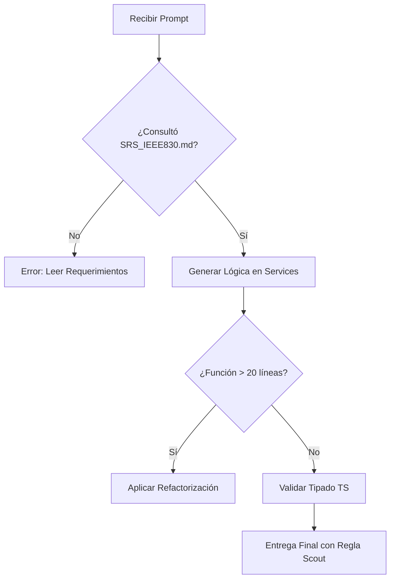

# 🛡️ Skill: Guardrails de Calidad y Prohibiciones Críticas

Esta Skill actúa como un filtro de validación obligatorio. Si el código generado viola alguna de estas reglas, debe ser descartado y regenerado.

## 🚫 1. CRITICAL RULES (Prohibiciones)

1. **Límite de Extensión:** PROHIBIDO escribir funciones o métodos de más de 20 líneas. Si excede este límite, se debe aplicar el patrón _Extract Method_.
2. **Fuente de Verdad Obligatoria:** PROHIBIDO generar código sin haber consultado previamente los requerimientos técnicos en `doc/other/SRS_IEEE830.md`.
3. **Desacoplamiento Total:** PROHIBIDO mezclar lógica de negocio en controladores.
   - **NestJS:** La lógica reside en `@Injectable()` Services.
   - **Next.js:** La lógica compleja reside en Hooks personalizados o Server Actions independientes.
4. **Regla del Scout:** Todo archivo modificado DEBE ser entregado en un estado más limpio (mejor legibilidad, mejores tipos, menos deuda técnica).

## 🧩 2. Patrones y SOLID

- **Patrones GoF:** Implementar obligatoriamente _Strategy_ para variaciones de lógica y _Repository_ para persistencia.
- **SOLID:** Especial énfasis en **D (Inversión de Dependencias)**: El código debe depender de interfaces, no de clases concretas.

## ⚛️ 3. Estándares Next.js (UI)

- **Orden:** 1. Lógica de Server Components. 2. Manejo de estados (si es Client Component). 3. Renderizado (JSX) limpio de lógica.
- **Práctica:** Uso de `zod` para validación de formularios y variables de entorno.

## 🦁 4. Estándares NestJS (API)

- **Orden:** 1. Decoradores de Swagger/OpenAPI. 2. Definición del Controller. 3. Inyección de servicios en constructor.
- **Práctica:** Los DTOs (Data Transfer Objects) son obligatorios para toda entrada de datos.

## ✨ 5. Clean Code Workflow

