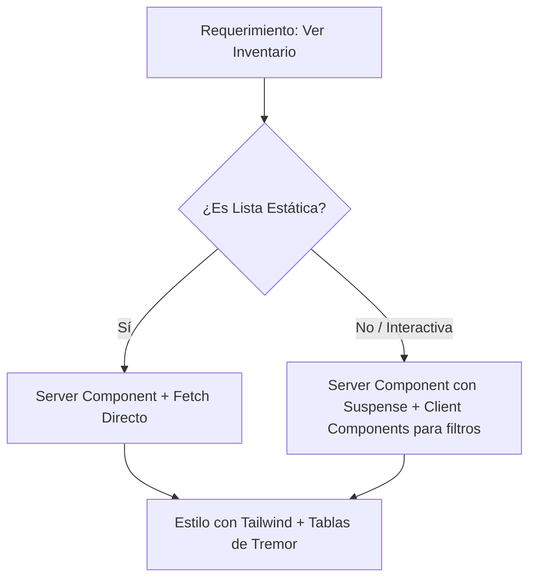

# 🎨 Skill: Estrategia de Interfaz y UX (Home-Health)

Esta Skill guía al agente para construir interfaces de alto rendimiento y estética profesional médica.

## 🚀 1. Renderizado Server-First (Next.js 15+)

- **Prioridad:** Todo componente es un _Server Component_ por defecto.
- **Catálogos:** El renderizado de listas de pacientes, inventarios y registros médicos debe ocurrir en el servidor para optimizar el SEO y la carga inicial.
- **Data Fetching:** Usa `async/await` directamente en el componente de servidor. No uses `useEffect` para carga de datos iniciales.

## 💅 2. Estética y Sistema de Diseño

- **Framework:** Uso exclusivo de **Tailwind CSS**. PROHIBIDO el uso de CSS modules o estilos en línea extensos.
- **Dashboards:** Para visualización de datos de salud (gráficas, KPIs, tablas de métricas), se debe usar obligatoriamente la librería **Tremor**.
- **Coherencia:** Mantener un diseño "Clean & Clinical": espacios amplios, tipografía legible y paleta de colores basada en la salud (azules, blancos, grises suaves).

## 🏗️ 3. Estructura de Componentes en Next.js

1. **Shared Components:** `ui/components/shared/` (Botones, Inputs básicos).
2. **Feature Components:** `ui/components/features/[feature-name]/` (Lógica específica de salud).
3. **Dashboards:** `ui/app/(dashboard)/` (Uso intensivo de Tremor).

## 🧩 4. Ejemplo de Implementación (Estructura Mental)

