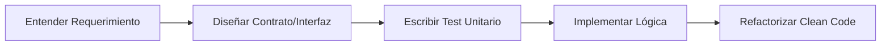

# 🛠️ Skill: Estándares de Arquitectura y Código Limpio

Esta habilidad define el ADN técnico de Home-Health. Todo agente debe validar su salida contra estos estándares.

## 🏗️ 1. Patrones de Diseño de Referencia

Dependiendo del contexto, prioriza estos patrones:

- **Dependency Injection:** Obligatorio en NestJS para desacoplar servicios.
- **Repository Pattern:** Para el acceso a datos en `api/`, aislando TypeORM/Prisma de la lógica de negocio.
- **Factory Pattern:** Para la creación de objetos complejos (ej. diferentes tipos de planes de salud).
- **Strategy Pattern:** Para manejar diferentes métodos de pago o tipos de seguros.

## 🧱 2. Principios SOLID (Checklist)

1. **S (Single Responsibility):** Una clase/función hace UNA sola cosa. Si el nombre tiene un "And", divídela.
2. **O (Open/Closed):** El código debe ser extensible sin modificar lo existente.
3. **L (Liskov Substitution):** Las subclases deben poder sustituir a sus bases sin romper nada.
4. **I (Interface Segregation):** No obligues a un cliente a depender de métodos que no usa.
5. **D (Dependency Inversion):** Depende de abstracciones, no de implementaciones concretas.

## 🌐 3. Next.js 15 (Frontend) - Prácticas y Orden

- **Componentes:** Prioriza _Server Components_ por defecto. Usa `"use client"` solo si hay interactividad (hooks).
- **Estructura de Carpeta:** `app/` para rutas, `components/` para UI atómica, `hooks/` para lógica compartida.
- **Orden de Archivo:**
  1. Imports (Externos -> Internos).
  2. Types/Interfaces.
  3. Componente Principal.
  4. Sub-componentes privados (si existen).
- **Fetch:** Usa el `fetch` nativo de Next.js para aprovechar el caching de nivel de servidor.

## 🦅 4. NestJS (Backend) - Prácticas y Orden

- **Arquitectura:** Sigue el flujo `Controller -> Service -> Repository`.
- **Validación:** Usa `class-validator` y `Pipes` globales para sanear entradas.
- **Orden de Clase:**
  1. Constructor (Inyección de dependencias).
  2. Métodos Públicos (Endpoints).
  3. Métodos Privados (Lógica interna).
- **Errores:** Lanza siempre `HttpException` específicas (ej. `NotFoundException`).

## ✨ 5. Clean Code & Legibilidad

- **Nombres:** Variables descriptivas (`isPatientActive` en lugar de `act`).
- **Funciones:** No más de 20 líneas. Si es más larga, extrae funciones privadas.
- **Comentarios:** Solo para el "Por qué" (decisiones de negocio), nunca para el "Qué" (el código debe explicarse solo).
- **DRY (Don't Repeat Yourself):** Si copias y pegas más de 2 veces, crea un helper o skill.

## 🔄 Flujo de Desarrollo Sugerido

