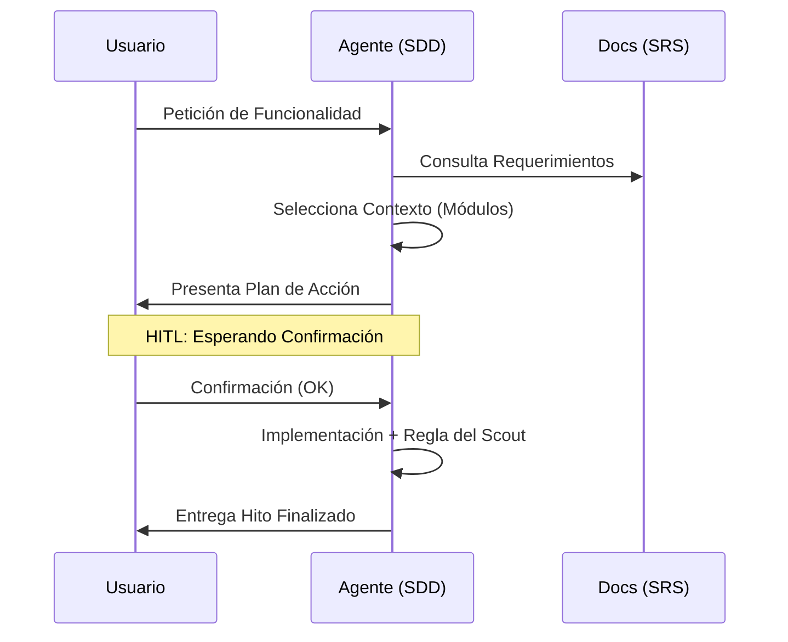

# 🧠 Skill: Orquestador de Flujo SDD

Esta Skill es el motor de razonamiento de Home-Health. Obliga al agente a pensar, planificar y pedir permiso antes de ejecutar.

## 🔄 1. Fase de Carga (Context Selection)

- **Acción:** Identificar si la tarea pertenece a `api/` (NestJS) o `ui/` (Next.js).
- **Aislamiento:** Cargar solo los archivos del módulo afectado:
  - `auth/` (RBC, JWT).
  - `inventory/` (Stock, Médicos).
  - `subscription/` (Pagos, Tiers).
- **Prohibición:** No intentar leer todo el repositorio si la tarea es modular.

## 📝 2. Fase de Diseño (Action Plan)

- **Output:** Antes de generar código, el agente debe emitir un **Plan de Acción** en texto plano.
- **Validación:** El plan debe citar explícitamente cómo cumple con los requerimientos de `doc/others/SRS_IEEE830.md`.
- **Estructura del Plan:** 1. Objetivo. 2. Archivos a modificar. 3. Patrones de diseño a aplicar.

## 🚦 3. Fase de Validación Humana (HITL)

- **Protocolo:** El agente se detendrá obligatoriamente después de presentar el Plan de Acción.
- **Pregunta Crítica:** "He diseñado el plan basado en el SRS. ¿Deseas que proceda con la implementación o prefieres ajustar la lógica?".
- **PROHIBIDO:** Escribir código sin el "OK" explícito del usuario.

## 🛠️ 4. Fase de Ejecución y Limpieza

- **Implementación:** Aplicar los cambios siguiendo las Skills de Clean Code y Arquitectura.
- **Regla del Scout:** Si detectas deuda técnica (variables mal nombradas, funciones largas, falta de tipos) en el archivo que estás tocando, **límpialo** como parte de la tarea.

## 📊 Visualización del Flujo

